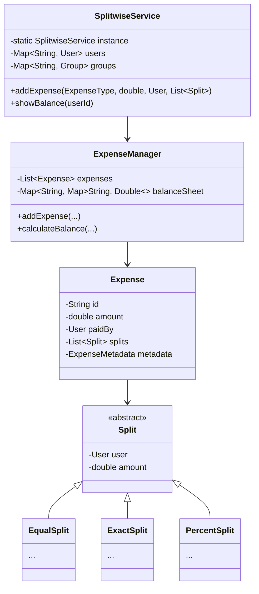

# Design Splitwise

> **Difficulty**: Medium
> **Topics**: Strategy Pattern, Graph Simplification, Observer Pattern
> **Key Concepts**: Managing debts, different split types (Equal, Exact, Percent).

## Phase 1: Requirements Gathering

### Goals
- Design an expense sharing application.
- Identify users, groups, and expense types.
- Define how debts are recorded and settled.

### 1. Who are the actors?
- **User**: Adds expenses, views balances, settles debts.
- **Group**: A collection of users sharing expenses.
- **System**: Calculates splits and updates balances.

### 2. What are the must-have features? (Core)
- **Add Expense**: User pays, others owe.
- **Split Types**: Support Equal, Exact, and Percentage splits.
- **Balance Sheet**: Show net balance per user.
- **Settle Up**: Record payments to clear debts.

### 3. What are the constraints?
- **Validation**: Percentages must add to 100%. Exact amounts must equal total.
- **Precision**: Handle currency rounding (2 decimal places).

---

## Phase 2: Use Cases

### UC1: Add Expense
**Actor**: User
**Flow**:
1. User selects a group or friends.
2. User enters total amount and selects split type (e.g., Equal).
3. System validates the split.
4. System calculates individual shares.
5. System updates the Balance Sheet (Graph).
6. System notifies involved users.

### UC2: Settle Up
**Actor**: User
**Flow**:
1. User A pays User B X amount.
2. System records a "Payment" transaction.
3. System updates the debt graph (A owes B reduced by X).

---

## Phase 3: Class Diagram

### Step 1: Core Entities
- **SplitwiseService**: Facade for operations.
- **ExpenseManager**: Manages expenses and balances.
- **Expense**: Stores details (amount, payer, splits).
- **Split**: Abstract class for split logic.
- **User**: Participant.

### Step 2: Relationships
- `Expense` **has-many** `Split`.
- `Split` **references** `User`.
- `ExpenseManager` **has-many** `Expense`.

### UML Diagram



---

## Phase 4: Design Patterns

### 1. Strategy Pattern
- **Description**: Defines a family of algorithms, encapsulates each one, and makes them interchangeable.
- **Why used**: Different split types (`EqualSplit`, `ExactSplit`, `PercentSplit`) require different validation and calculation logic. Strategy allows adding new split types easily.

### 2. Observer Pattern
- **Description**: Defines a one-to-many dependency between objects so that when one object changes state, all its dependents are notified and updated automatically.
- **Why used**: To notify group members when an expense is added, modified, or settled, ensuring all users have up-to-date balance information.

---

## Phase 5: Code Key Methods

### Java Implementation

```java
import java.util.*;

// 1. Core Entities
class User {
    String id;
    String name;
    public User(String id, String name) { this.id = id; this.name = name; }
}

abstract class Split {
    User user;
    double amount;
    public Split(User user) { this.user = user; }
    public double getAmount() { return amount; }
    public void setAmount(double amount) { this.amount = amount; }
}

class EqualSplit extends Split {
    public EqualSplit(User user) { super(user); }
}

class ExactSplit extends Split {
    public ExactSplit(User user, double amount) { super(user); this.amount = amount; }
}

// 2. Expense Models
class Expense {
    String id;
    double amount;
    User paidBy;
    List<Split> splits;
    
    public Expense(double amount, User paidBy, List<Split> splits) {
        this.amount = amount;
        this.paidBy = paidBy;
        this.splits = splits;
    }
}

// 3. Managers
class ExpenseManager {
    List<Expense> expenses;
    Map<String, Map<String, Double>> balanceSheet; // UserID -> (OwedUserID -> Amount)

    public ExpenseManager() {
        expenses = new ArrayList<>();
        balanceSheet = new HashMap<>();
    }

    public void addExpense(double amount, User paidBy, List<Split> splits) {
        Expense expense = new Expense(amount, paidBy, splits);
        expenses.add(expense);

        for (Split split : splits) {
            String paidTo = split.user.id;
            Map<String, Double> balances = balanceSheet.computeIfAbsent(paidBy.id, k -> new HashMap<>());
            
            // Current User (paidBy) receives (+amount) from split user
            if (!balances.containsKey(paidTo)) balances.put(paidTo, 0.0);
            balances.put(paidTo, balances.get(paidTo) + split.getAmount());

            // Split User (paidTo) owes (-amount) to paidBy
            Map<String, Double> debtorBalances = balanceSheet.computeIfAbsent(paidTo, k -> new HashMap<>());
            if (!debtorBalances.containsKey(paidBy.id)) debtorBalances.put(paidBy.id, 0.0);
            debtorBalances.put(paidBy.id, debtorBalances.get(paidBy.id) - split.getAmount());
        }
    }

    public void showBalance(String userId) {
        System.out.println("Balance for " + userId + ":");
        Map<String, Double> balances = balanceSheet.get(userId);
        if (balances == null) {
            System.out.println("No balances.");
            return;
        }
        
        for (Map.Entry<String, Double> entry : balances.entrySet()) {
            if (entry.getValue() != 0) {
                printBalance(userId, entry.getKey(), entry.getValue());
            }
        }
    }

    private void printBalance(String user1, String user2, double amount) {
        if (amount < 0) {
            System.out.println(user1 + " owes " + user2 + ": " + Math.abs(amount));
        } else if (amount > 0) {
            System.out.println(user2 + " owes " + user1 + ": " + amount);
        }
    }
}

// 4. Client
public class SplitwiseDemo {
    public static void main(String[] args) {
        User u1 = new User("u1", "Alice");
        User u2 = new User("u2", "Bob");
        User u3 = new User("u3", "Charlie");

        ExpenseManager manager = new ExpenseManager();

        // 1. Equal Split: Alice paid 300 for Alice, Bob, Charlie (100 each)
        // Note: The logic to divide 300 by 3 would be in the Service layer before creating EqualSplit objects
        
        List<Split> splits = new ArrayList<>();
        // Alice pays 300 total.
        // Alice owes herself 100 (net 0 effect usually filtered, but kept for logic)
        // Bob owes Alice 100
        // Charlie owes Alice 100
        
        Split s2 = new EqualSplit(u2); s2.setAmount(100);
        Split s3 = new EqualSplit(u3); s3.setAmount(100);
        splits.add(s2); splits.add(s3);

        // We only add splits for others to the manager typically, or handle self-split logic internally.
        // For simplicity here, Alice paid 300 total, covering 100 for Bob and 100 for Charlie.
        // We register the debt for Bob and Charlie.
        
        manager.addExpense(300, u1, splits);
        
        manager.showBalance("u2"); // Bob owes ...
        manager.showBalance("u1"); // Alice is owed ...
    }
}
```

---

## Phase 6: Discussion

### Debt Simplification
**Q: How to simplify debts (minimize transactions)?**
- A: "Use a **Min-Heap and Max-Heap**. Calculate the net balance for each user (Credits - Debts).
    1. Push users with `net > 0` to Max-Heap (Creditors).
    2. Push users with `net < 0` to Min-Heap (Debtors).
    3. Pop max creditor ($C$) and max debtor ($D$).
    4. Settle amount `min(|D|, |C|)`.
    5. Update remaining balance and push back to heaps if not zero.
    6. Repeat until heaps are empty."

### Scalability
**Q: How to handle millions of users?**
- A: "Shard users by `UserID`. Since most expenses are within a `Group`, shard groups by `GroupID` and ensure all group data resides on the same shard to avoid cross-shard transactions."

### Concurrency
**Q: Handling race conditions (two people editing same expense)?**
- A: "Use **Optimistic Locking** (versioning) on the Expense object. If version mismatch during save, prompt user to refresh."

---

## SOLID Principles Checklist

- **S (Single Responsibility)**: `Expense` stores data, `ExpenseManager` calculates logic, `Split` defines type.
- **O (Open/Closed)**: New `Split` types (e.g., specific share) can be added by extending `Split`.
- **L (Liskov Substitution)**: `EqualSplit` works wherever `Split` is needed.
- **I (Interface Segregation)**: Not heavily used, but interfaces are clean.
- **D (Dependency Inversion)**: `ExpenseManager` depends on `Split` abstraction.
