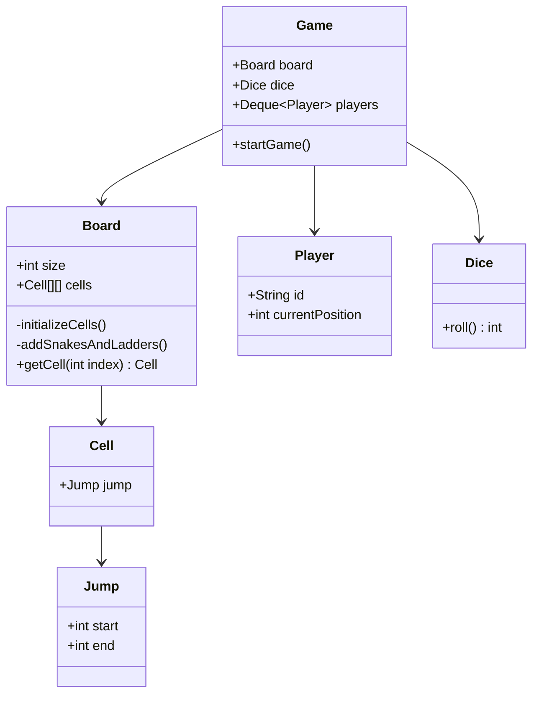

# Design Snake & Ladder

> **Difficulty**: Beginner  
> **Topics**: Board Games, HashMap / 1D Array Logic, Randomness  
> **Key Concepts**: Board entity, Dice roll, Player movement, Jumps (Snakes/Ladders).

## Phase 1: Requirements Gathering

### Goals
- Design a Snake and Ladder game for multiple players.
- Identify core entities: Board, Dice, Player.
- Define game rules and winning conditions.

### 1. Who are the actors?
- **Players**: Race to reach the final position (100).
- **Game System**: Manages the board, dice rolls, and turn flow.

### 2. What are the must-have features? (Core)
- **Board**: A 10x10 grid (numbered 1-100).
- **Dice**: A standard 6-sided dice.
- **Snakes**: Regress player position (Start > End).
- **Ladders**: Advance player position (Start < End).
- **Movement**: Player moves forward based on dice roll.
- **Win Condition**: First player to reach position 100 wins.

### 3. What are the constraints?
- **Winning**: Must land exactly on 100 (optional rule, but standard is >= 100 or == 100).
- **Jumps**: Snakes and Ladders are static configurations on the board.

---

## Phase 2: Use Cases

### UC1: Play Turn
**Actor**: Player
**Flow**:
1. Player rolls the dice.
2. System calculates NEW position (Current + Dice).
3. System checks if NEW position has a Jump (Snake/Ladder).
4. If Jump exists, update NEW position to Jump End.
5. System updates Player's position.
6. Check if Player won.
7. If not, pass turn to next player.

---

## Phase 3: Class Diagram

### Step 1: Core Entities
- **Game**: Orchestrator.
- **Board**: Contains Cells and Jumps.
- **Cell**: Represents a square on the board.
- **Player**: Has position and ID.
- **Dice**: Generates random numbers.
- **Jump**: Represents both Snake and Ladder (Start, End).

### UML Diagram



---

## Phase 4: Design Patterns

### 1. Strategy Pattern (Optional)
- **Description**: Defines a family of algorithms, encapsulates each one, and makes them interchangeable.
- **Why used**: Allows switching between different Dice implementations (`NormalDice`, `CrookedDice`, `SumDice`) without changing the Game logic.

### 2. Singleton Pattern (Optional)
- **Description**: Ensures a class has only one instance and provides a global point of access to it.
- **Why used**: The `Game` class manages the global state of the match (board, players, turns). A single instance ensures there is only one authoritative source of truth for the game status.

---

## Phase 5: Code Key Methods

### Java Implementation

```java
import java.util.*;
import java.util.concurrent.ThreadLocalRandom;

// 1. Jump Entity (Snake or Ladder)
class Jump {
    int start;
    int end;

    public Jump(int start, int end) {
        this.start = start;
        this.end = end;
    }
}

// 2. Cell Entity
class Cell {
    Jump jump;
}

// 3. Board Entity
class Board {
    Cell[][] cells;

    Board(int boardSize, int numberOfSnakes, int numberOfLadders) {
        initializeCells(boardSize);
        addSnakesLadders(cells, numberOfSnakes, numberOfLadders);
    }

    private void initializeCells(int boardSize) {
        cells = new Cell[boardSize][boardSize];
        for(int i=0;i<boardSize;i++) {
            for(int j=0; j<boardSize;j++) {
                Cell cellObj = new Cell();
                cells[i][j] = cellObj;
            }
        }
    }

    private void addSnakesLadders(Cell[][] cells, int numberOfSnakes, int numberOfLadders) {
        // Logic to add random jumps would go here.
        // For interview, you can hardcode a few or explain the randomization logic:
        // 1. Pick random start, end.
        // 2. Ensure start > end for Snake.
        // 3. Ensure start < end for Ladder.
        // 4. Ensure no cycle (Snake head at Ladder bottom).
        
        // Example Hardcoded:
        // Ladder: 2 -> 20
        // Snake: 99 -> 10
    }
    
    public Cell getCell(int playerPosition) {
        // Map linear position (1-100) to 2D coordinates
        // Note: Logic depends on board numbering (ZigZag or standard).
        // For simplicity in this LLD, we treat it as row-major or just use linear logic if board was 1D.
        // Here assuming simple row-major for 2D access:
        int boardRow = playerPosition / cells.length;
        int boardCol = (playerPosition % cells.length);
        if (boardRow >= cells.length) return null; // Out of bounds
        return cells[boardRow][boardCol];
    }
}

// 4. Player Entity
class Player {
    String id;
    int currentPosition;

    public Player(String id, int currentPosition) {
        this.id = id;
        this.currentPosition = currentPosition;
    }
}

// 5. Dice Entity
class Dice {
    int diceCount;
    int min = 1;
    int max = 6;

    public Dice(int diceCount) {
        this.diceCount = diceCount;
    }

    public int rollDice() {
        int totalSum = 0;
        int diceUsed = 0;
        while (diceUsed < diceCount) {
            totalSum += ThreadLocalRandom.current().nextInt(min, max + 1);
            diceUsed++;
        }
        return totalSum;
    }
}

// 6. Game Orchestrator
public class Game {
    Board board;
    Dice dice;
    Deque<Player> playersList = new LinkedList<>();
    Player winner;

    public Game() {
        initializeGame();
    }

    private void initializeGame() {
        board = new Board(10, 5, 5);
        dice = new Dice(1);
        winner = null;
        addPlayers();
    }

    private void addPlayers() {
        Player player1 = new Player("p1", 0);
        Player player2 = new Player("p2", 0);
        playersList.add(player1);
        playersList.add(player2);
    }

    public void startGame() {
        while(winner == null) {
            // Check whose turn now
            Player playerTurn = playersList.removeFirst();
            System.out.println("player turn is:" + playerTurn.id + " current position is: " + playerTurn.currentPosition);

            // Roll the dice
            int diceValue = dice.rollDice();

            // Calculate new position
            int playerNewPosition = playerTurn.currentPosition + diceValue;
            playerNewPosition = jumpCheck(playerNewPosition);
            playerTurn.currentPosition = playerNewPosition;

            System.out.println("player turn is:" + playerTurn.id + " new Position is: " + playerNewPosition);

            if(playerNewPosition >= 100){
                winner = playerTurn;
            }

            playersList.addLast(playerTurn);
        }

        System.out.println("WINNER IS:" + winner.id);
    }

    private int jumpCheck(int playerNewPosition) {
        if(playerNewPosition > 100 ){
            return playerNewPosition;
        }

        Cell cell = board.getCell(playerNewPosition);
        if(cell != null && cell.jump != null && cell.jump.start == playerNewPosition) {
            String jumpBy = (cell.jump.start < cell.jump.end) ? "ladder" : "snake";
            System.out.println("jump done by: " + jumpBy);
            return cell.jump.end;
        }
        return playerNewPosition;
    }
}
```

---

## Phase 6: Discussion

### Entity Design
**Q: Why Single Jump Class?**
- A: "Polymorphism isn't strictly needed here. Snake and Ladder behavior is identical: `Move player from A to B`. The only difference is `A > B` vs `A < B`, which is data, not behavior. A single `Jump` class is simpler."

### Validation (SDE-3 Concept)
**Q: How do you prevent infinite loops (e.g., A ladder takes you to a snake that takes you back to the ladder)?**
- A: "During `Board` initialization, perform **Cycle Detection** using a Directed Graph approach (DFS with recursion stack tracking). 
  - Nodes: Board cells (1-100).
  - Edges: Snakes and Ladders.
  If a cycle exists in the jump graph, the board is invalid and an exception should be thrown."

### Extensibility
**Q: How to add special squares (e.g., Skip Turn)?**
- A: "Extend `Cell` to have a `CellType` or `Effect`. Or use **Chain of Responsibility** where the move passes through handlers like `SnakeHandler`, `LadderHandler`, `FreezeHandler`."

### Dice Variations
**Q: How to handle multiple dice?**
- A: "The `Dice` class already supports `diceCount`. We can extend `rollDice()` to sum up N dice."

---

## SOLID Principles Checklist

- **S (Single Responsibility)**: `Board` holds grid, `Dice` rolls numbers, `Game` manages loop.
- **O (Open/Closed)**: New Jump types (e.g., `Teleport`) can be added by extending `Jump` or modifying `jumpCheck`.
- **L (Liskov Substitution)**: Not heavily used, but `Jump` subclasses would work if we had them.
- **I (Interface Segregation)**: `Dice` could implement `IDice` to allow `RiggedDice`.
- **D (Dependency Inversion)**: `Game` depends on abstract `Dice` logic (conceptually).
