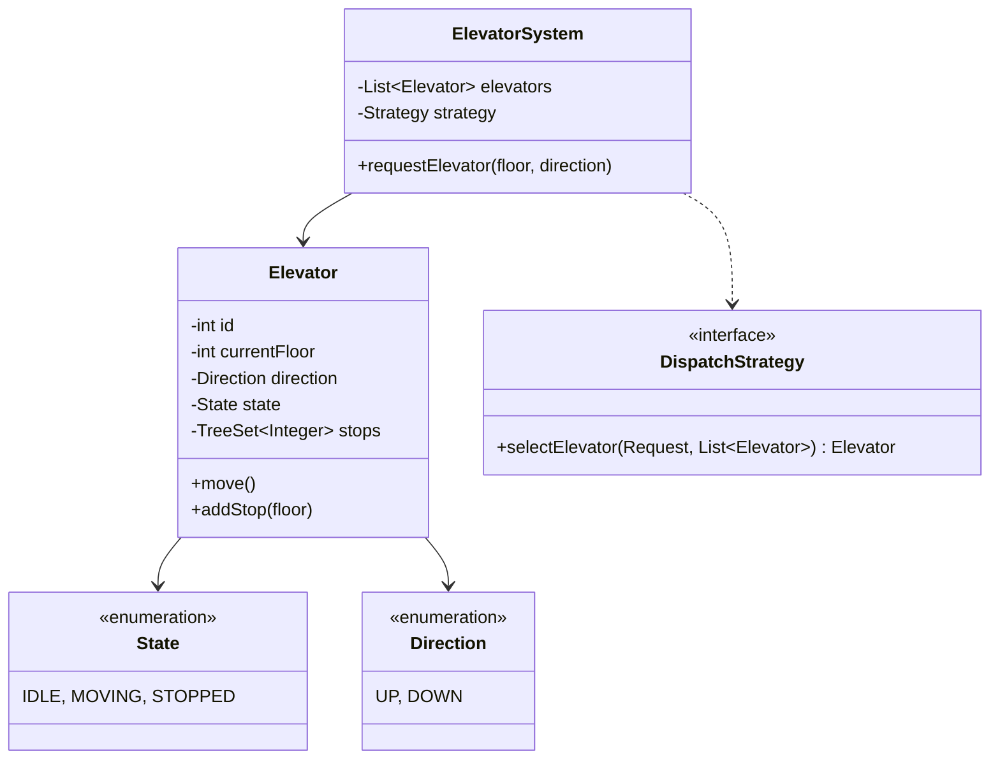

# Design Elevator System

> **Difficulty**: Medium
> **Topics**: State Design Pattern, Strategy Pattern, Scheduling Algorithm (SCAN)
> **Key Concepts**: Concurrency, Request Optimization, State Management.

## Phase 1: Requirements Gathering

### Goals
- Design a smart elevator system for a building (M floors, N elevators).
- Efficiently schedule elevators to minimize wait time.
- Handle concurrent requests safely.

### 1. Who are the actors?
- **Passenger**: Presses buttons inside or outside the elevator.
- **System**: Dispatches elevators and manages their state.

### 2. What are the must-have features? (Core)
- **External Request**: User presses Up/Down button on a floor.
- **Internal Request**: User presses a specific floor button inside the elevator.
- **Scheduling**: Algorithm to decide which elevator services a request.
- **Door Control**: Open/Close logic based on state.
- **Safety**: Don't change direction mid-flight unless idle; respect capacity (optional).

### 3. What are the constraints?
- **Real-time**: Decisions must be made instantly.
- **Optimization**: Prefer minimizing wait time vs. minimizing power (usually wait time).

---

## Phase 2: Use Cases

### UC1: Request Elevator (External)
**Actor**: Passenger
**Flow**:
1. Passenger on Floor X presses 'UP'.
2. System receives `ExternalRequest(Floor X, UP)`.
3. Dispatcher selects the best elevator (e.g., closest moving UP or Idle).
4. Elevator adds Floor X to its stop list.
5. Elevator arrives at Floor X, opens doors.

### UC2: Select Destination (Internal)
**Actor**: Passenger
**Flow**:
1. Passenger enters elevator and presses 'Floor Y'.
2. System receives `InternalRequest(ElevatorID, Floor Y)`.
3. Elevator adds Floor Y to its stop list.
4. Elevator moves to Floor Y.

---

## Phase 3: Class Diagram

### Step 1: Core Entities
- **ElevatorSystem**: Singleton controller.
- **Elevator**: The physical car.
- **Request**: External (Floor, Direction) or Internal (Floor).
- **Dispatcher**: Implementation of scheduling logic.
- **State**: Enum (IDLE, MOVING_UP, MOVING_DOWN).

### UML Diagram



---

## Phase 4: Design Patterns

### 1. Strategy Pattern
- **Description**: Defines a family of algorithms, encapsulates each one, and makes them interchangeable.
- **Why used**: The elevator dispatching logic (`DispatchStrategy`) can vary (First-Come-First-Serve, Shortest Seek Time First, SCAN/Elevator Algorithm). Strategy allows hot-swapping these algorithms based on traffic patterns (e.g., Morning Rush vs. Idle time).

### 2. State Pattern
- **Description**: Allows an object to alter its behavior when its internal state changes.
- **Why used**: An Elevator has different valid actions depending on its state (e.g., cannot `move()` if `DoorsOpen`, cannot `openDoors()` if `Moving`). State pattern encapsulates this logic, preventing invalid transitions.

---

## Phase 5: Code Key Methods

### Java Implementation

```java
import java.util.*;

// 1. Enums
enum Direction { UP, DOWN }
enum State { IDLE, MOVING_UP, MOVING_DOWN }

// 2. Request Wrapper
class Request {
    int floor;
    Direction direction; // null for internal requests if needed, or separate class
    public Request(int floor, Direction direction) {
        this.floor = floor;
        this.direction = direction;
    }
}

// 3. Elevator (The Worker)
class Elevator {
    int id;
    int currentFloor;
    State state;
    
    // Using TreeSet to keep stops sorted. 
    // Two sets: one for floors above (processing UP), one for floors below (processing DOWN).
    // This simplifies the LOOK algorithm logic.
    TreeSet<Integer> upStops = new TreeSet<>();
    TreeSet<Integer> downStops = new TreeSet<>((a, b) -> b - a); // Reverse order

    public Elevator(int id) {
        this.id = id;
        this.currentFloor = 0; // Ground floor
        this.state = State.IDLE;
    }

    public synchronized void addStop(int floor) {
        if (floor > currentFloor) {
            upStops.add(floor);
            if (state == State.IDLE) state = State.MOVING_UP;
        } else if (floor < currentFloor) {
            downStops.add(floor);
            if (state == State.IDLE) state = State.MOVING_DOWN;
        } else {
            // Already here, open doors (omitted)
        }
        System.out.println("Elevator " + id + " added floor: " + floor);
    }

    // Simulate movement step (e.g., called every second by a scheduler loop)
    public void move() {
        if (state == State.IDLE) return;

        if (state == State.MOVING_UP) {
            if (!upStops.isEmpty()) {
                int next = upStops.higher(currentFloor) != null ? upStops.higher(currentFloor) : upStops.first();
                // Simulation jump (in reality, currentFloor++)
                if (next > currentFloor) currentFloor++; 
                
                if (upStops.contains(currentFloor)) {
                    System.out.println("Elevator " + id + " stopping at " + currentFloor);
                    upStops.remove(currentFloor);
                }
            }
            if (upStops.isEmpty()) {
                state = downStops.isEmpty() ? State.IDLE : State.MOVING_DOWN;
            }
        } else if (state == State.MOVING_DOWN) {
            if (!downStops.isEmpty()) {
                int next = downStops.higher(currentFloor) != null ? downStops.higher(currentFloor) : downStops.first(); // 'higher' in reverse set is logically lower
                if (next < currentFloor) currentFloor--;
                
                if (downStops.contains(currentFloor)) {
                    System.out.println("Elevator " + id + " stopping at " + currentFloor);
                    downStops.remove(currentFloor);
                }
            }
            if (downStops.isEmpty()) {
                state = upStops.isEmpty() ? State.IDLE : State.MOVING_UP;
            }
        }
    }
}

// 4. Dispatcher Strategy
class ElevatorController {
    List<Elevator> elevators;

    public ElevatorController(int numElevators) {
        elevators = new ArrayList<>();
        for (int i = 0; i < numElevators; i++) {
            elevators.add(new Elevator(i + 1));
        }
    }

    public void requestElevator(int floor, Direction dir) {
        // Strategy: Find nearest elevator moving in same direction or IDLE
        // This is a simplified dispatch logic.
        Elevator best = null;
        int minDistance = Integer.MAX_VALUE;

        for (Elevator e : elevators) {
            int dist = Math.abs(e.currentFloor - floor);
            // In a real interview, elaborate on this logic:
            // If e is moving UP and floor > current, it's a candidate.
            // If e is moving UP and floor < current, it's NOT a candidate (unless it wraps around).
            
            if (dist < minDistance) {
                minDistance = dist;
                best = e;
            }
        }
        
        if (best != null) {
            best.addStop(floor);
        }
    }
    
    // Simulate time passing
    public void step() {
        for(Elevator e : elevators) e.move();
    }
}

// 5. Client
public class ElevatorDemo {
    public static void main(String[] args) {
        ElevatorController system = new ElevatorController(1);
        
        System.out.println("-- Person at Floor 5 presses UP --");
        system.requestElevator(5, Direction.UP);
        
        // Simulating ticks
        system.step(); // 0 -> 1
        system.step(); // 1 -> 2
        system.step(); // 2 -> 3
        system.step(); // 3 -> 4
        system.step(); // 4 -> 5 (Stop)
    }
}
```

---

## Phase 6: Discussion

### Algorithms
**Q: Explain Scheduling Algorithms?**
- **FCFS**: First Come First Serve. Simple but inefficient (bad throughput).
- **SSTF**: Shortest Seek Time First. Goes to nearest request. Can cause starvation for distant floors.
- **SCAN**: Elevator moves all the way UP, then all the way DOWN. Efficient but suboptimal average wait.
- **LOOK**: Similar to SCAN, but reverses direction as soon as there are no more requests in the current direction. **Preferred**.

### Capacity & Safety (SDE-3 Concept)
**Q: How to handle max weight realistically?**
- A: "In real life, elevators don't track the *number* of people, algorithms track weight. Add a `WeightSensor` class (Observer pattern) that publishes `WeightExceededEvent`. When triggered, transition to an `OVERLOADED` state, trigger an alarm, and disable door close mechanisms until the event resolves. Software should fail-safe."

### Thread Management (SDE-3 Concept)
**Q: How do you handle multiple elevators moving concurrently?**
- A: "Each `Elevator` should implement `Runnable` and run in its own thread, managed by a `ScheduledExecutorService`. The `Dispatcher` calculates the route, while the `Elevator` thread independently checks its `StopSet` and `State`, sleeping between floors to simulate travel time safely."

### Optimization
**Q: How to handle Peak Hours (Morning Rush)?**
- A: "Use **Zoning**. Dedicate specific elevators to serve only Ground -> Even Floors or Ground -> Odd Floors, or specific High/Low rise banks to reduce stops."

---

## SOLID Principles Checklist

- **S (Single Responsibility)**: `Elevator` moves/stops, `Controller` dispatches.
- **O (Open/Closed)**: Can implement new `DispatchStrategy` (e.g., `PeakHourStrategy`) without changing Controller code.
- **L (Liskov Substitution)**: `Elevator` behaviors are consistent.
- **I (Interface Segregation)**: `DispatchStrategy` is focused.
- **D (Dependency Inversion)**: `ElementSystem` should depend on `DispatchStrategy` interface.
