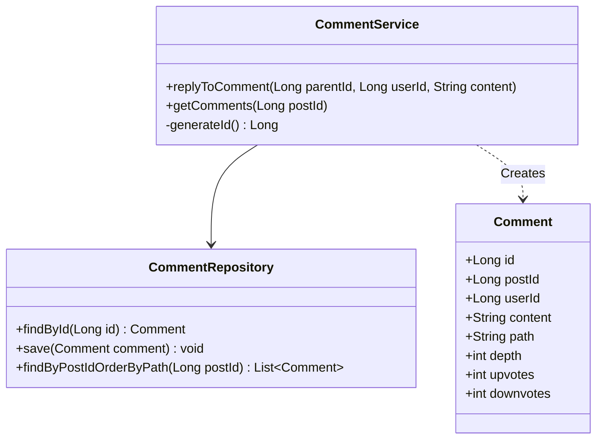

# Design Reddit Comments System

> **Difficulty**: Medium
> **Topics**: Database Schema, Hierarchical Data, Materialized Path, Recursion
> **Key Concepts**: Storing trees in SQL, Read vs Write optimization.

## Phase 1: Requirements Gathering

### Goals
- Design a scalable comment system supporting infinite nesting.
- Efficiently store and retrieve deep comment trees.
- Handle high read volume (viral posts).

### 1. Who are the actors?
- **User**: Posts comments, replies, upvotes/downvotes.
- **System**: Renders comment threads, manages scores.

### 2. What are the must-have features? (Core)
- **Posting**: Add a root comment or a reply.
- **Retrieval**: Fetch comments for a post in hierarchical order (Threaded view).
- **Ranking**: Order by score (Upvotes - Downvotes) or time.
- **Pagination**: Load top-level comments and expand replies on demand.

### 3. What are the constraints?
- **Scale**: Millions of comments per popular post.
- **Latency**: Read latency must be low (< 200ms).
- **Depth**: Support deep nesting (e.g., 50+ levels).

---

## Phase 2: Use Cases

### UC1: Post Comment/Reply
**Actor**: User
**Flow**:
1. User submits content for a `PostId` (and optionally `ParentId` if reply).
2. System calculates `Path` and `Depth` based on Parent.
3. System saves comment to DB.
4. System updates denormalized counts (e.g., total comments on post).

### UC2: View Comments
**Actor**: User
**Flow**:
1. User requests comments for `PostId`.
2. System fetches comments ordered by `Path` (Materialized Path sorting gives DFS order).
3. Frontend renders tree structure using `Depth`.

---

## Phase 3: Class Diagram

### Step 1: Core Entities
- **Comment**: The main unit of content.
- **User**: Author.
- **Post**: Context container.
- **Vote**: User interaction.

### UML Diagram



### Database Schema

#### Table: `Comments`
| Column | Type | Description |
| :--- | :--- | :--- |
| `id` | BIGINT | PK |
| `post_id` | BIGINT | The Post ID |
| `user_id` | BIGINT | The Author |
| `parent_id` | BIGINT | Direct Parent (NULL for Root) |
| `path` | VARCHAR | Lineage: `0001/0050/0101` |
| `depth` | INT | Indentation Level |
| `content` | TEXT | Body |
| `upvote_count` | INT | Denormalized count |

*Index: `(post_id, path)` for fast retrieval.*

---

## Phase 4: Design Patterns

### 1. Materialized Path Pattern
- **Description**: A hierarchical data model where each node stores its full ancestry path (e.g., "1/5/9") as a string.
- **Why used**: Allows fetching an entire comment subtree or sorting by conversation thread depth with a simple `ORDER BY path` query, avoiding expensive recursive joins or CTEs in the database.

### 2. CQRS (Command Query Responsibility Segregation)
- **Description**: Separates read and update operations for a data store.
- **Why used**: Comment systems often have high read-to-write ratios (Viral posts). CQRS allows optimizing the Read model (denormalized, flat structure) differently from the Write model (normalized, relational) for performance.

---

## Phase 5: Code Key Methods

### Java Implementation

```java
import java.sql.SQLException;
import java.util.*;

// 1. Comment POJO
class Comment {
    private Long id;
    private Long postId;
    private Long userId;
    private Long parentId;
    private String path;
    private int depth;
    private String content;

    // Getters and Setters
    public String getPath() { return path; }
    public void setPath(String path) { this.path = path; }
    public int getDepth() { return depth; }
    public void setDepth(int depth) { this.depth = depth; }
    public void setId(Long id) { this.id = id; }
    public void setPostId(Long postId) { this.postId = postId; }
    public void setUserId(Long userId) { this.userId = userId; }
    public void setParentId(Long parentId) { this.parentId = parentId; }
    public void setContent(String content) { this.content = content; }
}

// 2. Repository Interface
interface CommentRepository {
    Comment findById(Long id);
    void save(Comment comment);
    // SELECT * FROM Comments WHERE post_id = ? ORDER BY path ASC
    List<Comment> findByPostIdOrderByPath(Long postId); 
}

// 3. Service Layer
public class CommentService {
    private CommentRepository commentRepository;

    public CommentService(CommentRepository commentRepository) {
        this.commentRepository = commentRepository;
    }

    // Logic to post a root comment
    public void addRootComment(Long postId, Long userId, String content) {
        Long newId = generateId();
        String path = String.format("%04d", newId); // Pad ID for string sorting
        
        Comment c = new Comment();
        c.setId(newId);
        c.setPostId(postId);
        c.setUserId(userId);
        c.setContent(content);
        c.setPath(path);
        c.setDepth(0);
        
        commentRepository.save(c);
    }

    // Logic to reply to an existing comment
    public void replyToComment(Long parentId, Long userId, Long postId, String content) {
        // 1. Fetch parent to get path info
        Comment parent = commentRepository.findById(parentId);
        if (parent == null) throw new IllegalArgumentException("Parent comment not found");

        // 2. Generate ID
        Long newId = generateId(); 
        
        // 3. Construct Path: ParentPath + "/" + SelfID
        String childPath = parent.getPath() + "/" + String.format("%04d", newId);
        int childDepth = parent.getDepth() + 1;

        // 4. Create Object
        Comment newComment = new Comment();
        newComment.setId(newId);
        newComment.setPostId(postId);
        newComment.setUserId(userId);
        newComment.setParentId(parentId);
        newComment.setPath(childPath);
        newComment.setDepth(childDepth);
        newComment.setContent(content);

        // 5. Save
        commentRepository.save(newComment);
        System.out.println("Reply added at path: " + childPath);
    }
    
    private Long generateId() {
        // In reality, use Snowflake or DB Sequence
        return System.nanoTime(); 
    }
}
```

---

## Phase 6: Discussion

### Tree Storage Strategies (SDE-3 Concept)
**Q: Why Materialized Path? What are the alternatives for Storing Trees in RDBMS?**
- **Adjacency List (`parent_id`)**: Good for inserts, but fetching a whole tree requires Recursive CTEs (`WITH RECURSIVE`). Slow for deep trees ($O(N)$ depth queries).
- **Materialized Path**: Storing string path allows simple `ORDER BY path` to get DFS tree traversal order. Fast reads. Downside: Moving a subtree requires rewriting paths for all descendants.
- **Closure Table (SDE-3 Alternative)**: Store a separate table `CommentPaths (ancestor_id, descendant_id, depth)`. Every node maps to all its descendants. 
  - *Pros:* Fully normalized, blazing fast to find all descendants of any comment at any depth. Moving subtrees is easier than Materialized Path.
  - *Cons:* Storage overhead ($O(N^2)$ rows in the worst case of a straight line discussion). Best trade-off for Reddit-style systems where reads vastly outnumber writes.

### Scaling
**Q: How to handle viral threads (100k+ comments)?**
- **Pagination**: Don't load everything. Fetch top-level comments first (`depth=0`). Load replies asynchronously when user clicks "Load More".
- **Caching**: Cache the first page of comments for popular posts in Redis.

### Denormalization
**Q: Where to store vote counts?**
- A: Store `upvote_count` in the `Comments` table. Do not `COUNT(*)` from `Votes` table on every read. Update this counter asynchronously or in batch when votes occur.

---

## SOLID Principles Checklist

- **S (Single Responsibility)**: Service handles logic, Repository handles DB.
- **O (Open/Closed)**: New retrieval strategies (e.g., Sort by Top) can be added.
- **D (Dependency Inversion)**: Service depends on Repository interface.
