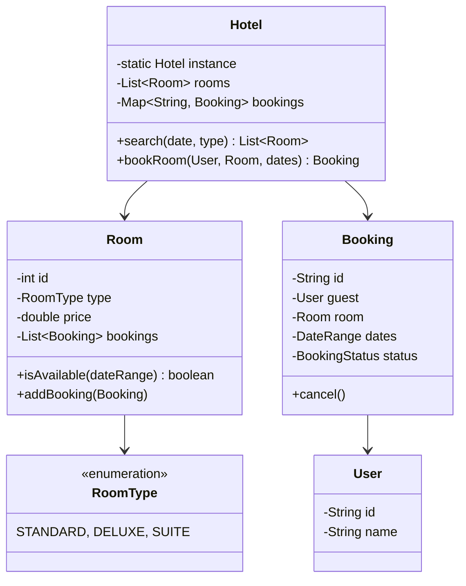

# Design Hotel Management System

> **Difficulty**: Medium
> **Topics**: Object-Oriented Design, Concurrency, Date Logic
> **Key Concepts**: Booking management, room allocation, avoiding double bookings.

## Phase 1: Requirements Gathering

### Goals
- Design a system to manage hotel bookings.
- Support room search, booking, and cancellation.
- specific focus on concurrency (prevent double booking).

### 1. Who are the actors?
- **Guest**: Searches for rooms, makes bookings.
- **Receptionist**: Checks guests in/out, manages bookings.
- **System**: Validates availability, stores data.

### 2. What are the must-have features? (Core)
- **Search**: Find rooms by type (Standard, Deluxe, Suite) and date range.
- **Book**: Reserve a room for a specific user.
- **Cancel**: Refund and release room.
- **Check-in/Out**: Update booking status.

### 3. What are the constraints?
- **Concurrency**: Two users cannot book the same room for overlapping dates.
- **Invariant**: Bookings must not overlap for the same room.

---

## Phase 2: Use Cases

### UC1: Search Rooms
**Actor**: User
**Flow**:
1. User enters `StartDate`, `EndDate`, and `RoomType`.
2. System filters all rooms of `RoomType`.
3. System checks availability for each room against existing bookings.
4. System returns list of available rooms.

### UC2: Book Room
**Actor**: User
**Flow**:
1. User selects a specific `Room`.
2. System attempts to lock the room/date slots.
3. System verifies availability one last time (Double Check).
4. System creates `Booking` record.
5. System confirms reservation.

---

## Phase 3: Class Diagram

### Step 1: Core Entities
- **Hotel**: Singleton, manages Rooms.
- **Room**: Has ID, Type, Price, and List of Bookings.
- **Booking**: Links User, Room, DateRange.
- **User/Guest**: Person making the booking.

### UML Diagram



---

## Phase 4: Design Patterns

### 1. Singleton Pattern
- **Description**: Ensures a class has only one instance and provides a global point of access to it.
- **Why used**: The `Hotel` system acts as the centralized controller for all rooms and bookings. A single instance ensures consistent access to the inventory and prevents data inconsistency.

### 2. Lock / Synchronization (Concurrency Pattern)
- **Description**: Mechanisms to control access to shared resources by multiple threads.
- **Why used**: Two guests might try to book the same room at the same exact second. Locking (Optimistic or Pessimistic) ensures only one transaction succeeds, preventing double bookings.

---

## Phase 5: Code Key Methods

### Java Implementation

```java
import java.util.*;
import java.util.concurrent.*;
import java.time.LocalDate;

// 1. Enums & Helpers
enum RoomType { STANDARD, DELUXE, SUITE }
enum BookingStatus { CONFIRMED, CANCELLED, CHECKED_IN }

class DateRange {
    LocalDate start;
    LocalDate end;

    public DateRange(LocalDate start, LocalDate end) {
        this.start = start;
        this.end = end;
    }

    public boolean overlaps(DateRange other) {
        // (StartA < EndB) and (EndA > StartB)
        // Adjust logic depending on inclusive/exclusive dates
        return !start.isAfter(other.end.minusDays(1)) && !end.isBefore(other.start.plusDays(1));
    }
}

// 2. Core Entities
class Room {
    int id;
    RoomType type;
    double price;
    List<DateRange> bookedDates; // Sorted list of booked ranges

    public Room(int id, RoomType type, double price) {
        this.id = id;
        this.type = type;
        this.price = price;
        this.bookedDates = new ArrayList<>();
    }

    // Check if room is free for the given range
    public synchronized boolean isAvailable(DateRange range) {
        for (DateRange booked : bookedDates) {
            if (booked.overlaps(range)) return false;
        }
        return true;
    }

    // Atomic check-and-book
    public synchronized boolean book(DateRange range) {
        if (!isAvailable(range)) return false;
        bookedDates.add(range);
        return true;
    }
}

class User {
    String id, name;
    public User(String id, String name) { this.id = id; this.name = name; }
}

class Booking {
    String id;
    User guest;
    Room room;
    DateRange dates;
    BookingStatus status;

    public Booking(User guest, Room room, DateRange dates) {
        this.id = UUID.randomUUID().toString();
        this.guest = guest;
        this.room = room;
        this.dates = dates;
        this.status = BookingStatus.CONFIRMED;
    }
}

// 3. Hotel System (Singleton)
class Hotel {
    private static Hotel instance;
    private List<Room> rooms;
    private Map<String, Booking> bookingMap;

    private Hotel() {
        rooms = new ArrayList<>();
        bookingMap = new ConcurrentHashMap<>();
    }

    public static synchronized Hotel getInstance() {
        if (instance == null) instance = new Hotel();
        return instance;
    }

    public void addRoom(Room room) { rooms.add(room); }

    public List<Room> searchRooms(RoomType type, DateRange range) {
        List<Room> available = new ArrayList<>();
        // In real DB, this filters by type AND checks NOT EXISTS(bookings overlapping dates)
        for (Room r : rooms) {
            if (r.type == type && r.isAvailable(range)) {
                available.add(r);
            }
        }
        return available;
    }

    public Booking bookRoom(User user, Room room, DateRange range) {
        // Critical Section: Ensure room isn't taken between search and book
        // Delegated to Room.synchronized method
        if (room.book(range)) {
            Booking booking = new Booking(user, room, range);
            bookingMap.put(booking.id, booking);
            System.out.println("Booking Successful: " + booking.id);
            return booking;
        }
        System.out.println("Booking Failed: Room unavailable.");
        return null;
    }
}

// 4. Client
public class HotelDemo {
    public static void main(String[] args) {
        Hotel hotel = Hotel.getInstance();
        hotel.addRoom(new Room(101, RoomType.STANDARD, 100.0));
        hotel.addRoom(new Room(102, RoomType.DELUXE, 200.0));

        User user = new User("u1", "John Doe");
        DateRange dates = new DateRange(LocalDate.now(), LocalDate.now().plusDays(2));

        // 1. Search
        List<Room> available = hotel.searchRooms(RoomType.STANDARD, dates);
        System.out.println("Available Rooms: " + available.size());

        // 2. Book
        if (!available.isEmpty()) {
            hotel.bookRoom(user, available.get(0), dates);
        }
        
        // 3. Try double booking
        hotel.bookRoom(new User("u2", "Jane"), available.get(0), dates); // Should fail
    }
}
```

---

## Phase 6: Discussion

### Concurrency & Isolation
**Q: How to handle concurrency in a massive distributed system?**
- A: "The Java `synchronized` only works on one machine. For distributed systems (multiple servers), rely on **Database Locking**."
    - **Optimistic Locking**: Add `version` column to Booking/Room table. `WHERE id=? AND version=current_version`.
    - **Pessimistic Locking**: `SELECT * FROM Rooms FOR UPDATE`.

### Expiration
**Q: How delay/expire unpaid bookings?**
- A: "Use a temporary status (`PENDING_PAYMENT`) with a TTL (Time To Live). A Redis key `booking:{id}` with expiry 10m can trigger a release if payment hook isn't received."

### Dynamic Pricing
**Q: How to handle pricing surges?**
- A: "Implement **Strategy Pattern** for pricing. `PricingStrategy` can calculate price based on demand (occupancy %), seasonality, or user loyalty."

---

## SOLID Principles Checklist

- **S (Single Responsibility)**: Room manages availability, Hotel manages Global Search.
- **O (Open/Closed)**: Add new `RoomTypes` or `PricingStrategies` without modifying core logic.
- **L (Liskov Substitution)**: N/A (Standard OOP).
- **I (Interface Segregation)**: Booking interfaces for Admin vs User could be split.
- **D (Dependency Inversion)**: Hotel could depend on `RoomRepository` instead of list.
