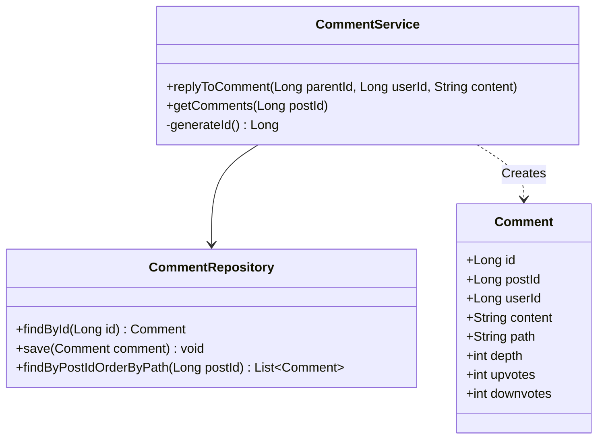

# Design Reddit Comments System (LLD & Schema)

> **Difficulty**: Medium  
> **Topics**: Database Schema, Hierarchical Data, Materialized Path, Recursion  
> **Extension**: Pagination, Vote Counts

## Problem Statement

Design a scalable comment system like Reddit.
- **Features**: Threaded comments (infinite nesting), Upvotes/Downvotes, Pagination.
- **Scale**: Millions of comments. Read-heavy.
- **Challenge**: Storing and fetching trees efficiently in SQL.

## Core Problem: Storing Trees in SQL

| Strategy | Concept | Pros | Cons | Verdict |
| :--- | :--- | :--- | :--- | :--- |
| **Adjacency List** | Column `parent_id` | Simple, easy inserts. | Fetching tree needs recursive queries (CTEs). Slow for deep trees. | Standard |
| **Materialized Path** | Column `path` (e.g., "001/005/012") | Fast subtree retrieval via prefix scan. Sorting by string path gives DFS order! | Moving subtrees is hard. | **Best for Reddit** |

## Database Schema

### Table 1: `Comments`

```sql
CREATE TABLE Comments (
    id BIGINT PRIMARY KEY AUTO_INCREMENT,
    post_id BIGINT NOT NULL,          -- The Thread ID
    user_id BIGINT NOT NULL,
    parent_id BIGINT NULL,            -- Optimization for direct parent lookups
    
    -- THE MAGIC COLUMN
    -- Stores the lineage: "root_id/child_id/grandchild_id"
    -- Example ID 101 nested under 50 nested under 1: "0001/0050/0101"
    path VARCHAR(255) NOT NULL,
    
    content TEXT,
    depth INT DEFAULT 0,              -- Indentation level (UI helper)
    
    -- Denormalized Counters (For Read Speed)
    upvote_count INT DEFAULT 0,
    downvote_count INT DEFAULT 0,
    
    created_at TIMESTAMP DEFAULT CURRENT_TIMESTAMP,
    
    INDEX idx_post_path (post_id, path) -- Crucial for "ORDER BY path"
);
```

### Table 2: `Votes` (Prevent double voting)

```sql
CREATE TABLE CommentVotes (
    user_id BIGINT,
    comment_id BIGINT,
    vote_value TINYINT, -- +1 for Up, -1 for Down
    PRIMARY KEY (user_id, comment_id)
);
```

## Key Operations

### 1. Fetching the Tree (Depth-First Order)
Sorting by `path` naturally groups comments in the correct threaded order for UI.

```sql
SELECT * FROM Comments 
WHERE post_id = 55 
ORDER BY path ASC 
LIMIT 50; 
```
**Result**:
1. `0001` (Root)
2. `0001/0002` (Child of 1)
3. `0001/0002/0003` (Grandchild of 1)
4. `0005` (New Root)

### 2. Inserting a Reply (Java Implementation)

Logic: `New_Path = Parent_Path + "/" + New_ID`.

#### Class Diagram



#### Flow Chart: Posting a Reply

```mermaid
flowchart TD
    A[User Request: Reply to Comment X] --> B{Validate Parent X Exists?}
    B -- No --> C[Error: Parent Not Found]
    B -- Yes --> D[Fetch Parent Path & Depth]
    D --> E[Generate New ID]
    E --> F[Construct New Path: ParentPath + / + NewID]
    F --> G[Increment Depth: ParentDepth + 1]
    G --> H[Save New Comment to DB]
    H --> I[Update Cache (Async)]
    I --> J[Return Success]
```

#### Java Code

```java
import java.sql.Connection;
import java.sql.PreparedStatement;
import java.sql.ResultSet;
import java.sql.SQLException;
import java.util.UUID;

public class CommentService {
    private CommentRepository commentRepository;

    public CommentService(CommentRepository commentRepository) {
        this.commentRepository = commentRepository;
    }

    // Method to handle a reply to an existing comment
    public void replyToComment(Long parentId, Long userId, Long postId, String content) throws SQLException {
        // 1. Fetch parent comment to get its path and depth
        Comment parent = commentRepository.findById(parentId);
        if (parent == null) {
            throw new IllegalArgumentException("Parent comment not found");
        }

        // 2. Generate a new ID (could be from sequence or snowflake)
        Long newId = generateId(); 
        
        // 3. Construct the new path: Parent Path + "/" + Formatted ID
        // Formatting ID ensuring consistent length for string sorting
        String childPath = parent.getPath() + "/" + String.format("%04d", newId);
        int childDepth = parent.getDepth() + 1;

        // 4. Create the new comment object
        Comment newComment = new Comment();
        newComment.setId(newId);
        newComment.setPostId(postId);
        newComment.setUserId(userId);
        newComment.setParentId(parentId);
        newComment.setPath(childPath);
        newComment.setDepth(childDepth);
        newComment.setContent(content);

        // 5. Save to database
        commentRepository.save(newComment);
        
        System.out.println("Comment replied successfully with path: " + childPath);
    }
    
    private Long generateId() {
        // Placeholder for ID geeration logic (e.g., Snowflake, DB Sequence)
        return System.currentTimeMillis(); 
    }
}

// Simple POJO for Comment
class Comment {
    private Long id;
    private Long postId;
    private Long userId;
    private Long parentId;
    private String path;
    private int depth;
    private String content;
    
    // Getters and Setters omitted for brevity
    
    public String getPath() { return path; }
    public void setPath(String path) { this.path = path; }
    public int getDepth() { return depth; }
    public void setDepth(int depth) { this.depth = depth; }
    public void setId(Long id) { this.id = id; }
    public void setPostId(Long postId) { this.postId = postId; }
    public void setUserId(Long userId) { this.userId = userId; }
    public void setParentId(Long parentId) { this.parentId = parentId; }
    public void setContent(String content) { this.content = content; }
}

// Mock Repository Interface
interface CommentRepository {
    Comment findById(Long id);
    void save(Comment comment);
}
```

## Optimization & Scaling

1.  **Viral Post (Hot Partition)**: Shard DB by `post_id`. All comments for a post stay on one shard to maintain the tree.
2.  **Denormalization**: `upvote_count` in `Comments` table avoids `COUNT(*)` on huge `Votes` table every read.
3.  **Caching**: Cache top 200 comments of hot threads in Redis (List/SortedSet).
