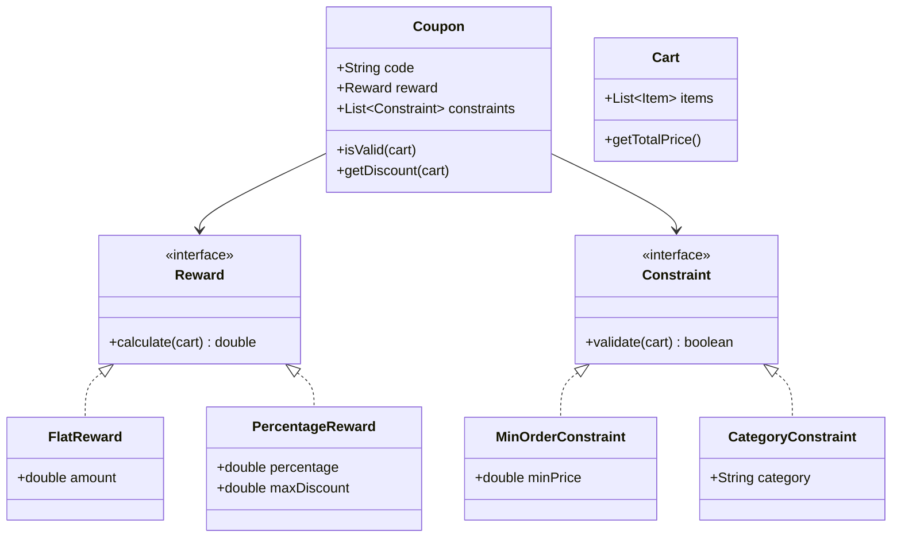

# Design Coupon & Discount System

> **Difficulty**: Medium  
> **Topics**: Strategy Pattern, Chain of Responsibility, Composite Pattern  
> **Similar**: Zepto, Amazon, Swiggy Discounts

## Problem Statement

Design a flexible coupon system that supports:
1.  **Discount Types**: Percentage ("10% Off"), Flat ("$50 Off"), Free Shipping.
2.  **Rules/Constraints**: Min Order Value, Specific Category, User Specific, Expiry Date.
3.  **Extensibility**: Marketing team introduces new rules (e.g., BOGO) without rewriting core logic.

## Java Implementation

#### Class Diagram



#### Flow Chart: Apply Coupon

```mermaid
flowchart TD
    A[User Applies Coupon Code] --> B[Fetch Coupon Logic]
    B --> C{Iterate Constraints}
    C --> D{Constraint.validate(Cart)?}
    D -- No --> E[Return: Coupon Invalid]
    D -- Yes --> F{More Constraints?}
    F -- Yes --> C
    F -- No --> G[Calculate Discount (Reward Strategy)]
    G --> H[Check Max Discount Cap]
    H --> I[Apply Discount to Cart]
```

#### Code

```java
import java.util.*;

// 1. Context (Cart)
class Item {
    String name;
    double price;
    String category;

    public Item(String name, double price, String category) {
        this.name = name;
        this.price = price;
        this.category = category;
    }
}

class Cart {
    List<Item> items = new ArrayList<>();

    public void addItem(Item item) {
        items.add(item);
    }

    public double getTotalPrice() {
        return items.stream().mapToDouble(i -> i.price).sum();
    }
}

// 2. Constraints (Validation Chain)
interface Constraint {
    boolean validate(Cart cart);
}

class MinOrderConstraint implements Constraint {
    double minPrice;
    public MinOrderConstraint(double minPrice) { this.minPrice = minPrice; }

    public boolean validate(Cart cart) {
        return cart.getTotalPrice() >= minPrice;
    }
}

class CategoryConstraint implements Constraint {
    String requiredCategory;
    public CategoryConstraint(String requiredCategory) { this.requiredCategory = requiredCategory; }

    public boolean validate(Cart cart) {
        return cart.items.stream().anyMatch(i -> i.category.equals(requiredCategory));
    }
}

// 3. Rewards (Strategy Pattern)
interface Reward {
    double calculate(Cart cart);
}

class FlatReward implements Reward {
    double amount;
    public FlatReward(double amount) { this.amount = amount; }

    public double calculate(Cart cart) { return amount; }
}

class PercentageReward implements Reward {
    double percentage;
    double maxDiscount;

    public PercentageReward(double percentage, double maxDiscount) {
        this.percentage = percentage;
        this.maxDiscount = maxDiscount;
    }

    public double calculate(Cart cart) {
        double discount = cart.getTotalPrice() * (percentage / 100);
        return Math.min(discount, maxDiscount);
    }
}

// 4. Coupon (Composite)
class Coupon {
    String code;
    Reward reward;
    List<Constraint> constraints = new ArrayList<>();

    public Coupon(String code, Reward reward) {
        this.code = code;
        this.reward = reward;
    }

    public void addConstraint(Constraint constraint) {
        constraints.add(constraint);
    }

    public boolean isValid(Cart cart) {
        for (Constraint c : constraints) {
            if (!c.validate(cart)) return false;
        }
        return true;
    }

    public double getDiscount(Cart cart) {
        if (isValid(cart)) {
            double discount = reward.calculate(cart);
            return Math.min(discount, cart.getTotalPrice());
        }
        return 0.0;
    }
}

// Usage
public class CouponSystem {
    public static void main(String[] args) {
        Cart cart = new Cart();
        cart.addItem(new Item("MacBook", 2000, "Electronics"));

        // Coupon: "ELECTRO10" (10% off up to $100 if cart > $500 & contains Electronics)
        Coupon coupon = new Coupon("ELECTRO10", new PercentageReward(10, 100));
        coupon.addConstraint(new MinOrderConstraint(500));
        coupon.addConstraint(new CategoryConstraint("Electronics"));

        System.out.println("Discount: $" + coupon.getDiscount(cart)); // Output: 100.0
    }
}
```

## Interview Talking Points

1.  **Why Strategy Pattern?**: Avoids `if-else` blocks for coupon types (`if type == 'PERCENT'`). Adding a new type just means adding a new `Reward` subclass.
2.  **Concurrency**: If a coupon is "First 100 users only", the `GlobalLimitConstraint` needs to interact with Redis `DECR` to prevent overselling.
3.  **Stacking Coupons**: `CouponManager` could take a list of coupons, apply one, update the effective price, and try applying the next.
