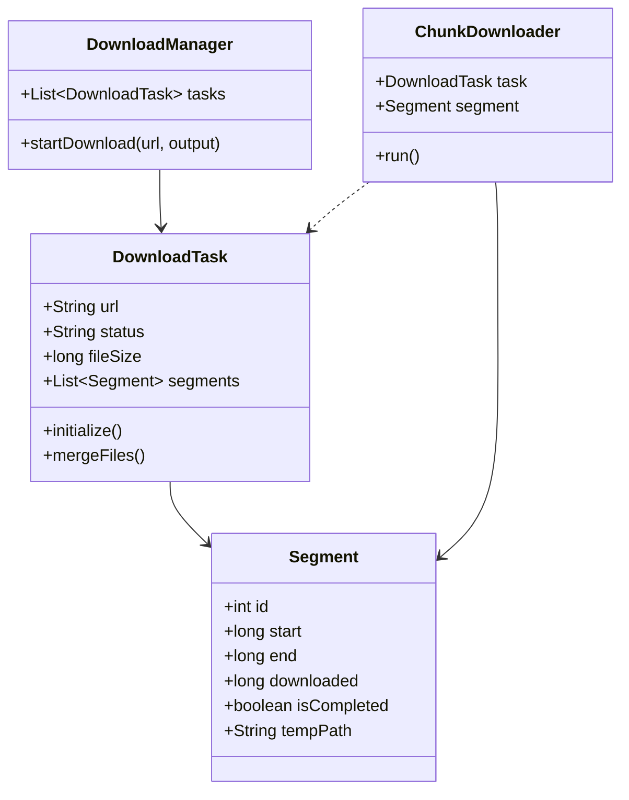

# Design Internet Download Manager (IDM)

> **Difficulty**: Intermediate  
> **Topics**: Concurrency, Multi-threading, HTTP Range Headers, File I/O  
> **Extension**: Resumable Downloads

## Problem Statement

Design a download manager that can:
1.  Download files from a URL.
2.  Accelerate download by splitting file into multiple parts (segments) and downloading in parallel.
3.  Pause and resume downloads.
4.  Merge segments into final file.
5.  Handle network failures.

## Core Concept: HTTP Range Headers

The magic of IDM lies in the HTTP protocol.

1.  **Head Request**: Send `HEAD` request to check file size (`Content-Length`) and if server supports parallel downloads (`Accept-Ranges: bytes`).
2.  **Range Request**: Workers send `GET` requests with specific byte ranges.
    *   _Worker 1:_ `Range: bytes=0-1000`
    *   _Worker 2:_ `Range: bytes=1001-2000`

## System Entities

1.  **DownloadTask**: Represents the file being downloaded. Holds metadata (URL, file size, status).
2.  **Segment (Chunk)**: Represents a specific byte range (Start, End) and its download status.
3.  **Worker (Thread)**: A separate thread responsible for downloading one Segment.
4.  **DownloadManager**: The Controller. Starts tasks, manages thread pool, and handles file assembly.

## Java Implementation

#### Class Diagram



#### Flow Chart: Parallel Download

```mermaid
flowchart TD
    A[Start Download Task] --> B[Head Request: Get File Size]
    B --> C{Accept-Ranges?}
    C -- No --> D[Create 1 Segment (Full File)]
    C -- Yes --> E[Split into N Segments]
    E --> F[Start N Threads in Parallel]
    D --> F
    F --> G{All Segments Complete?}
    G -- No --> F
    G -- Yes --> H[Merge Segments to Output File]
    H --> I[Delete Temp Files]
    I --> J[Mark Task Completed]
```

#### Code

```java
import java.io.*;
import java.net.HttpURLConnection;
import java.net.URL;
import java.util.*;
import java.util.concurrent.*;
import java.util.concurrent.atomic.AtomicBoolean;

enum DownloadStatus {
    PENDING, DOWNLOADING, COMPLETED, FAILED
}

// 1. Segment Entity
class Segment {
    int id;
    long start;
    long end;
    long downloaded;
    boolean isCompleted;
    File tempFile;

    public Segment(int id, long start, long end, File tempFile) {
        this.id = id;
        this.start = start;
        this.end = end;
        this.tempFile = tempFile;
        this.isCompleted = false;
        this.downloaded = 0;
    }
}

// 2. Worker Thread
class ChunkDownloader implements Runnable {
    private String fileUrl;
    private Segment segment;
    private CountDownLatch latch;
    private AtomicBoolean failed;

    public ChunkDownloader(String fileUrl, Segment segment, CountDownLatch latch, AtomicBoolean failed) {
        this.fileUrl = fileUrl;
        this.segment = segment;
        this.latch = latch;
        this.failed = failed;
    }

    @Override
    public void run() {
        if (segment.isCompleted) {
            latch.countDown();
            return;
        }

        long startByte = segment.start + segment.downloaded;
        if (startByte >= segment.end) {
            segment.isCompleted = true;
            latch.countDown();
            return;
        }

        try {
            URL url = new URL(fileUrl);
            HttpURLConnection conn = (HttpURLConnection) url.openConnection();
            String range = String.format("bytes=%d-%d", startByte, segment.end);
            conn.setRequestProperty("Range", range);
            
            System.out.println("Thread-" + segment.id + " downloading: " + range);

            try (InputStream in = conn.getInputStream();
                 RandomAccessFile raf = new RandomAccessFile(segment.tempFile, "rw")) {
                
                raf.seek(segment.downloaded);
                byte[] buffer = new byte[4096];
                int bytesRead;
                
                while ((bytesRead = in.read(buffer)) != -1) {
                    raf.write(buffer, 0, bytesRead);
                    segment.downloaded += bytesRead;
                }
            }
            
            segment.isCompleted = true;
            System.out.println("Thread-" + segment.id + " finished.");

        } catch (IOException e) {
            System.err.println("Thread-" + segment.id + " failed: " + e.getMessage());
            failed.set(true);
        } finally {
            latch.countDown();
        }
    }
}

// 3. Task Entity & Manager Logic
class DownloadTask {
    String url;
    String outputPath;
    int numThreads;
    long fileSize;
    List<Segment> segments;
    DownloadStatus status;

    public DownloadTask(String url, String outputPath, int numThreads) {
        this.url = url;
        this.outputPath = outputPath;
        this.numThreads = numThreads;
        this.segments = new ArrayList<>();
        this.status = DownloadStatus.PENDING;
    }

    public void start() {
        try {
            // 1. Get File Size
            HttpURLConnection conn = (HttpURLConnection) new URL(url).openConnection();
            conn.setRequestMethod("HEAD");
            fileSize = conn.getContentLengthLong();
            String ranges = conn.getHeaderField("Accept-Ranges");
            
            if(fileSize <= 0) throw new RuntimeException("Invalid file size");

            System.out.println("File Size: " + fileSize + " bytes");

            // 2. Create Segments
            if (ranges == null || !ranges.equals("bytes")) {
                segments.add(new Segment(0, 0, fileSize, new File(outputPath + ".part0")));
            } else {
                long chunkSize = fileSize / numThreads;
                for (int i = 0; i < numThreads; i++) {
                    long start = i * chunkSize;
                    long end = (i == numThreads - 1) ? fileSize : (start + chunkSize - 1) ; // Inclusive end
                    segments.add(new Segment(i, start, end, new File(outputPath + ".part" + i)));
                }
            }

            // 3. Start Parallel Download
            ExecutorService executor = Executors.newFixedThreadPool(numThreads);
            CountDownLatch latch = new CountDownLatch(segments.size());
            AtomicBoolean failed = new AtomicBoolean(false);

            for (Segment seg : segments) {
                executor.submit(new ChunkDownloader(url, seg, latch, failed));
            }

            latch.await();
            executor.shutdown();

            if (failed.get()) {
                status = DownloadStatus.FAILED;
                System.out.println("Download Failed!");
            } else {
                mergeFiles();
                status = DownloadStatus.COMPLETED;
                System.out.println("Download Complete!");
            }

        } catch (Exception e) {
            e.printStackTrace();
            status = DownloadStatus.FAILED;
        }
    }

    private void mergeFiles() throws IOException {
        System.out.println("Merging segments...");
        try (FileOutputStream fos = new FileOutputStream(outputPath)) {
            for (Segment seg : segments) {
                try (FileInputStream fis = new FileInputStream(seg.tempFile)) {
                    byte[] buffer = new byte[4096];
                    int read;
                    while ((read = fis.read(buffer)) != -1) {
                        fos.write(buffer, 0, read);
                    }
                }
                seg.tempFile.delete();
            }
        }
    }
}

// 4. Main Class
public class DownloadManager {
    public static void main(String[] args) {
        String url = "https://speed.hetzner.de/100MB.bin"; // Example URL
        String output = "file.bin";
        
        DownloadTask task = new DownloadTask(url, output, 4);
        task.start();
    }
}
```

## Key Design Decisions

1.  **Handling Resume (Persistence)**:
    *   Serialize `DownloadTask` (with segments and downloaded bytes) to a file (e.g., JSON) on disk.
    *   On startup, read file, reconstruct objects, and calculate new Range header: `bytes=(start + downloaded)-end`.

2.  **File I/O Optimization**:
    *   Use separate temporary files (`.part0`, `.part1`) to avoid locking contention on a single file. Merging at the end is faster than mutex locking on every write.

3.  **Concurrency Model**:
    *   Thread per Segment is simple but strictly bound (e.g., max 8 threads) to avoid context switching overhead.

4.  **Network Failure**:
    *   If a chunk fails, only that segment is marked `FAILED`. Retry logic spins up a new thread for just that segment.
