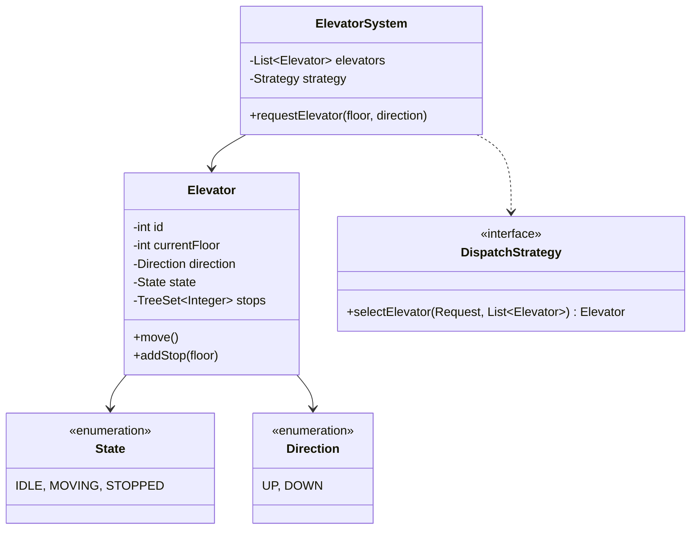
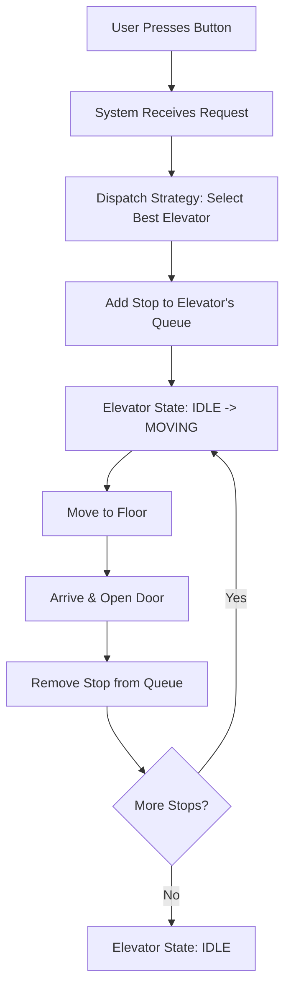

# Design Elevator System

> **Difficulty**: Medium
> **Topics**: State Design Pattern, Strategy Pattern, Scheduling Algorithm (SCAN)
> **Key Concepts**: Concurrency, Request Optimization, State Management.

## Problem Statement

Design a smart elevator system for a building:
1.  **Multiple Elevators**: Control `N` elevators.
2.  **Requests**: Handle internal (inside elevator) and external (floor) requests.
3.  **Optimization**: Efficiently schedule elevators to minimize wait time (e.g., SCAN/LOOK algorithm).
4.  **Safety**: Don't change direction mid-flight unless necessary.

## Class Diagram



## Flow Chart: Request Handling



## Java Implementation

```java
import java.util.*;

// 1. Enums
enum Direction { UP, DOWN }
enum State { IDLE, MOVING, STOPPED }

// 2. Request
class Request {
    int floor;
    Direction direction; // For external buttons
    public Request(int floor, Direction direction) {
        this.floor = floor;
        this.direction = direction;
    }
}

// 3. Elevator (The Worker)
class Elevator {
    int id;
    int currentFloor;
    Direction direction;
    State state;
    
    // Using TreeSet to keep stops sorted
    TreeSet<Integer> upStops = new TreeSet<>();
    TreeSet<Integer> downStops = new TreeSet<>((a, b) -> b - a); // Reverse order

    public Elevator(int id) {
        this.id = id;
        this.currentFloor = 0;
        this.direction = Direction.UP;
        this.state = State.IDLE;
        System.out.println("Elevator " + id + " online.");
    }

    public synchronized void addStop(int floor) {
        if (floor > currentFloor) upStops.add(floor);
        else if (floor < currentFloor) downStops.add(floor);
        else return; // Already here

        if (state == State.IDLE) {
            state = State.MOVING;
            direction = (floor > currentFloor) ? Direction.UP : Direction.DOWN;
        }
        System.out.println("Elevator " + id + " added stop: " + floor);
    }

    // Simulate movement (Simple SCAN Algorithm)
    public void move() {
        if (state == State.IDLE) return;

        // Determine next stop
        Integer nextStop = null;
        if (direction == Direction.UP) {
            nextStop = upStops.higher(currentFloor);
            if (nextStop == null) { // No more ups, switch?
                direction = Direction.DOWN;
                nextStop = downStops.higher(currentFloor); // Actually lower, since reverse set
            }
        } else {
            nextStop = downStops.higher(currentFloor); // "Higher" in reverse set is lower number
            if (nextStop == null) {
                direction = Direction.UP;
                nextStop = upStops.higher(currentFloor);
            }
        }

        if (nextStop != null) {
            System.out.println("Elevator " + id + " moving from " + currentFloor + " to " + nextStop);
            currentFloor = nextStop;
            
            // Remove stop
            if (direction == Direction.UP) upStops.remove(currentFloor);
            else downStops.remove(currentFloor);
            
            System.out.println("Elevator " + id + " arrived at " + currentFloor + ". Doors Opening.");
        } else {
            state = State.IDLE;
            System.out.println("Elevator " + id + " is IDLE at " + currentFloor);
        }
    }
}

// 4. Dispatcher Strategy
class ElevatorController {
    List<Elevator> elevators;

    public ElevatorController(int numElevators) {
        elevators = new ArrayList<>();
        for (int i = 0; i < numElevators; i++) {
            elevators.add(new Elevator(i + 1));
        }
    }

    public void requestElevator(int floor, Direction dir) {
        // Strategy: Find nearest elevator moving in same direction or IDLE
        Elevator best = null;
        int minDistance = Integer.MAX_VALUE;

        for (Elevator e : elevators) {
            int dist = Math.abs(e.currentFloor - floor);
            // Simplified Selection Logic
            if (dist < minDistance) {
                minDistance = dist;
                best = e;
            }
        }
        
        if (best != null) {
            best.addStop(floor);
            best.move(); // In real system, this runs in a separate thread loop
        }
    }
}

// 5. Client
public class ElevatorDemo {
    public static void main(String[] args) {
        ElevatorController system = new ElevatorController(2);
        
        System.out.println("-- Person at Floor 5 presses UP --");
        system.requestElevator(5, Direction.UP);
        
        System.out.println("-- Person at Floor 2 presses DOWN --");
        system.requestElevator(2, Direction.DOWN);
    }
}
```

## Interview Q&A

**Q: "Explain standard elevator algorithms."**
- A: "**FCFS**: Bad for throughput. **SSTF (Shortest Seek Time First)**: Can starve distant requests. **SCAN (Elevator Algorithm)**: Move all way up, then all way down. **LOOK**: Like SCAN but reverses as soon as no requests ahead."

**Q: "How to handle capacity (Weight Limit)?"**
- A: "Add `maxWeight` to Elevator. Hardware sensor triggers `WeightAlarm`. Logic: If `currentWeight > max`, don't close doors, ignore `move()` commands until weight reduced."

**Q: "Optimization for peak hours (e.g., Morning Rush)?"**
- A: "Zone locking. Assign specific elevators to specific zones (Low-rise, High-rise) to reduce stops per trip."
