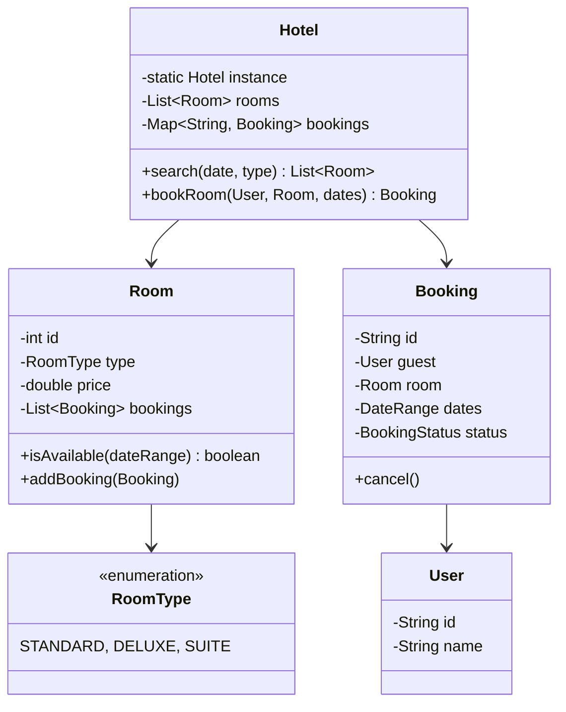
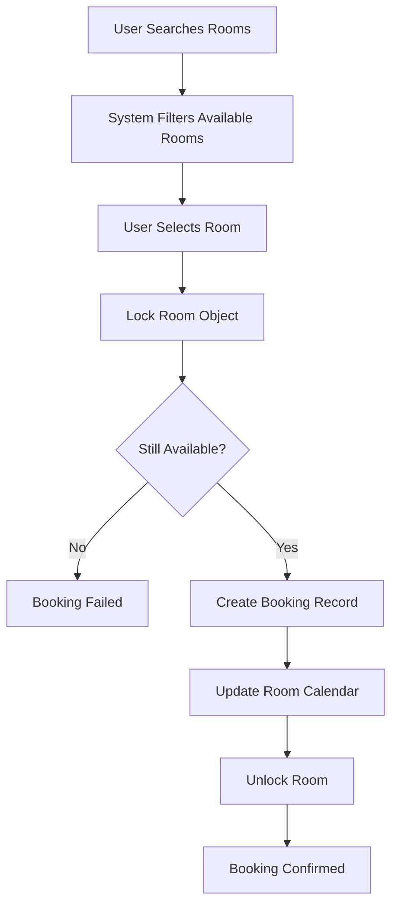

# Design Hotel Management System

> **Difficulty**: Medium
> **Topics**: Object-Oriented Design, Concurrency, Date Logic
> **Key Concepts**: Booking management, room allocation, avoiding double bookings.

## Problem Statement

Design a Hotel Management System that:
1.  **Search**: Allows users to search for available rooms by type and date range.
2.  **Booking**: Guests can book rooms, cancel bookings, and check-in/out.
3.  **Rooms**: Manages different room types (Standard, Deluxe, Suite).
4.  **Concurrency**: Handles multiple users trying to book the same room simultaneously.

## Class Diagram



## Flow Chart: Booking Process



## Java Implementation

```java
import java.util.*;
import java.util.concurrent.*;
import java.time.LocalDate;

// 1. Enums & Helpers
enum RoomType { STANDARD, DELUXE, SUITE }
enum BookingStatus { CONFIRMED, CANCELLED, CHECKED_IN }

class DateRange {
    LocalDate start;
    LocalDate end;

    public DateRange(LocalDate start, LocalDate end) {
        this.start = start;
        this.end = end;
    }

    public boolean overlaps(DateRange other) {
        // (StartA <= EndB) and (EndA >= StartB)
        return !start.isAfter(other.end) && !end.isBefore(other.start);
    }
}

// 2. Core Entities
class Room {
    int id;
    RoomType type;
    double price;
    List<DateRange> bookedDates; // Sorted list of booked ranges

    public Room(int id, RoomType type, double price) {
        this.id = id;
        this.type = type;
        this.price = price;
        this.bookedDates = new ArrayList<>();
    }

    public synchronized boolean isAvailable(DateRange range) {
        for (DateRange booked : bookedDates) {
            if (booked.overlaps(range)) return false;
        }
        return true;
    }

    public synchronized boolean book(DateRange range) {
        if (!isAvailable(range)) return false;
        bookedDates.add(range);
        return true;
    }
}

class User {
    String id, name;
    public User(String id, String name) { this.id = id; this.name = name; }
}

class Booking {
    String id;
    User guest;
    Room room;
    DateRange dates;
    BookingStatus status;

    public Booking(User guest, Room room, DateRange dates) {
        this.id = UUID.randomUUID().toString();
        this.guest = guest;
        this.room = room;
        this.dates = dates;
        this.status = BookingStatus.CONFIRMED;
    }
}

// 3. Hotel System (Singleton)
class Hotel {
    private static Hotel instance;
    private List<Room> rooms;
    private Map<String, Booking> bookingMap;

    private Hotel() {
        rooms = new ArrayList<>();
        bookingMap = new ConcurrentHashMap<>();
    }

    public static synchronized Hotel getInstance() {
        if (instance == null) instance = new Hotel();
        return instance;
    }

    public void addRoom(Room room) { rooms.add(room); }

    public List<Room> searchRooms(RoomType type, DateRange range) {
        List<Room> available = new ArrayList<>();
        for (Room r : rooms) {
            if (r.type == type && r.isAvailable(range)) {
                available.add(r);
            }
        }
        return available;
    }

    public Booking bookRoom(User user, Room room, DateRange range) {
        // Check and Book atomically inside Room class
        if (room.book(range)) {
            Booking booking = new Booking(user, room, range);
            bookingMap.put(booking.id, booking);
            System.out.println("Booking Successful: " + booking.id);
            return booking;
        }
        System.out.println("Booking Failed: Room unavailable.");
        return null;
    }
}

// 4. Client
public class HotelDemo {
    public static void main(String[] args) {
        Hotel hotel = Hotel.getInstance();
        hotel.addRoom(new Room(101, RoomType.STANDARD, 100.0));
        hotel.addRoom(new Room(102, RoomType.DELUXE, 200.0));

        User user = new User("u1", "John Doe");
        DateRange dates = new DateRange(LocalDate.now(), LocalDate.now().plusDays(2));

        // 1. Search
        List<Room> available = hotel.searchRooms(RoomType.STANDARD, dates);
        System.out.println("Available Rooms: " + available.size());

        // 2. Book
        if (!available.isEmpty()) {
            hotel.bookRoom(user, available.get(0), dates);
        }
        
        // 3. Try double booking
        hotel.bookRoom(new User("u2", "Jane"), available.get(0), dates); // Should fail
    }
}
```

## Interview Q&A

**Q: "How delay/expire unpaid bookings?"**
- A: "Use a temporary hold status (`PENDING_PAYMENT`) with a TTL (Time To Live). A scheduled job (or Redis Key Expiry) releases the room if payment isn't confirmed within 10 mins."

**Q: "How to handle pricing surges?"**
- A: "Implement dynamic pricing strategy based on occupancy rate. `calculatePrice(basePrice, date, currentOccupancy)`."

**Q: "Database Isolation for bookings?"**
- A: "Use `SERIALIZABLE` or `SELECT FOR UPDATE` (Pessimistic Locking) in SQL to prevent overbooking rows."
