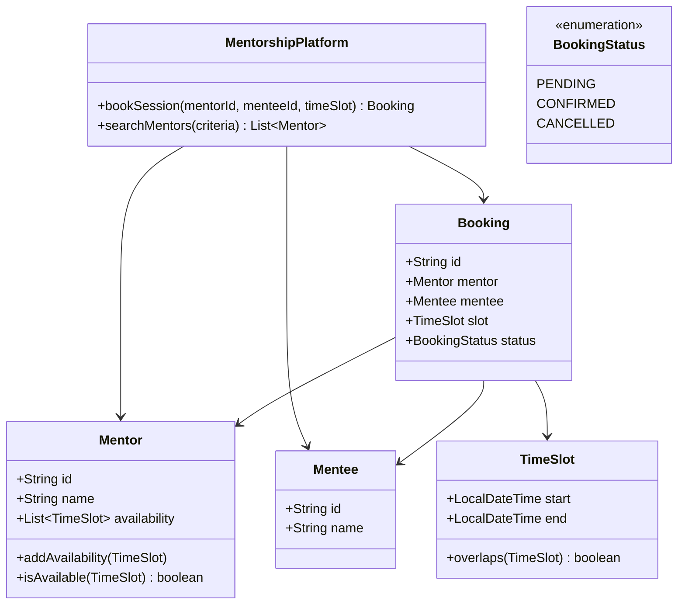

# Design Mentorship Platform (Preplaced/Topmate)

> **Difficulty**: Medium  
> **Topics**: Marketplace Dynamics, Availability Management, State Machine  
> **Entities**: Mentor, Mentee, Session, Calendar.

## Problem Statement

Connect Mentees with Mentors for booked sessions.
- **Challenges**: Handling Availability (Calendar slots), Booking Concurrency, Search/Matchmaking.

## Core Domain Models

### Availability (The Hard Part)

Mentors define availability: "Mon 9-11 AM".
- **Recurring**: `RecurringSchedule` table.
- **Exceptions**: `AvailabilityOverride` table (e.g., Sick leave on specific Mon).

### Booking Flow (State Machine)

`PENDING` -> `CONFIRMED` -> `COMPLETED` / `CANCELLED`

## Implementation

## Implementation (Java)

#### Class Diagram



#### Flow Chart: Booking a Session

```mermaid
flowchart TD
    A[Mentee Requests Booking] --> B{Is Slot Available?}
    B -- No --> C[Error: Slot Unavailable]
    B -- Yes --> D[Lock Slot (Concurrency Control)]
    D --> E{Double Check Availability}
    E -- No --> F[Release Lock & Error]
    E -- Yes --> G[Create Booking (PENDING)]
    G --> H[Update Mentor Availability]
    H --> I[Release Lock]
    I --> J[Notify Mentor & Mentee]
    J --> K[Return Booking Confirmation]
```

#### Java Code

```java
import java.time.LocalDateTime;
import java.util.*;
import java.util.concurrent.ConcurrentHashMap;
import java.util.concurrent.locks.Lock;
import java.util.concurrent.locks.ReentrantLock;

// 1. TimeSlot Entity
class TimeSlot {
    LocalDateTime start;
    LocalDateTime end;

    public TimeSlot(LocalDateTime start, LocalDateTime end) {
        this.start = start;
        this.end = end;
    }

    public boolean overlaps(TimeSlot other) {
        return this.start.isBefore(other.end) && other.start.isBefore(this.end);
    }
}

// 2. Mentor Entity
class Mentor {
    String id;
    String name;
    List<TimeSlot> availability;

    public Mentor(String id, String name) {
        this.id = id;
        this.name = name;
        this.availability = new ArrayList<>();
    }

    public void addAvailability(TimeSlot slot) {
        this.availability.add(slot);
    }

    // Check if mentor is available for a requested slot
    public boolean isAvailable(TimeSlot requestedSlot) {
        for (TimeSlot slot : availability) {
            if (slot.start.isEqual(requestedSlot.start) && slot.end.isEqual(requestedSlot.end)) {
                return true; // Simplified check (exact match)
            }
        }
        return false;
    }
    
    public void removeAvailability(TimeSlot slot) {
        availability.removeIf(s -> s.start.isEqual(slot.start) && s.end.isEqual(slot.end));
    }
}

// 3. Mentee Entity
class Mentee {
    String id;
    String name;

    public Mentee(String id, String name) {
        this.id = id;
        this.name = name;
    }
}

// 4. Booking Entity
class Booking {
    String id;
    Mentor mentor;
    Mentee mentee;
    TimeSlot slot;

    public Booking(Mentor mentor, Mentee mentee, TimeSlot slot) {
        this.id = UUID.randomUUID().toString();
        this.mentor = mentor;
        this.mentee = mentee;
        this.slot = slot;
    }
}

// 5. Booking System (Service)
public class BookingSystem {
    Map<String, Booking> bookings = new ConcurrentHashMap<>();
    // A simple lock map for demonstration. In production, use Redis Distributed Lock.
    Map<String, Lock> mentorLocks = new ConcurrentHashMap<>();

    public Booking bookSession(Mentor mentor, Mentee mentee, TimeSlot slot) {
        // 1. Get lock for the mentor to handle concurrency
        Lock lock = mentorLocks.computeIfAbsent(mentor.id, k -> new ReentrantLock());
        lock.lock();
        
        try {
            // 2. Double check availability under lock
            if (!mentor.isAvailable(slot)) {
                throw new IllegalStateException("Slot unavailable");
            }

            // 3. Create Booking
            Booking booking = new Booking(mentor, mentee, slot);
            bookings.put(booking.id, booking);

            // 4. Remove slot from availability (Consistency)
            mentor.removeAvailability(slot);
            
            System.out.println("Booking confirmed for " + mentee.name + " with " + mentor.name);
            return booking;
            
        } finally {
            lock.unlock();
        }
    }
}
```

## Key Discussion Points

1.  **Concurrency**: Two mentees book same slot.
    *   **Solution**: Database locks (`SELECT ... FOR UPDATE`) or Optimistic Locking (`version` column).
2.  **Calendar Integration**: Sync with Google Calendar.
    *   Need two-way sync. Webhooks from Google Cal to update system availability.
3.  **Search**: "Find Python mentors available this weekend".
    *   Use ElasticSearch. Index mentors with `skills` and `available_slots`.
