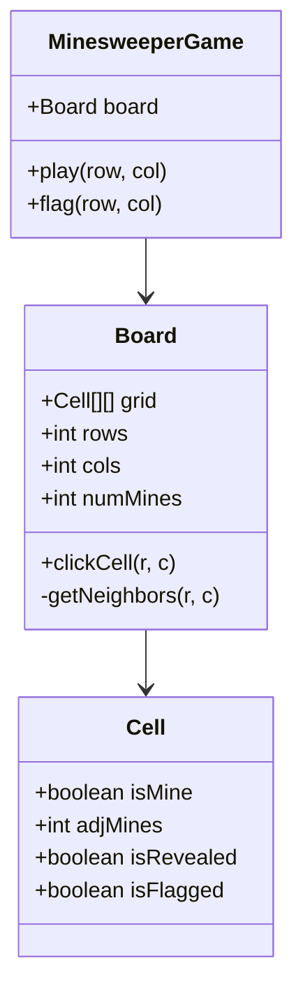

# Design Minesweeper

> **Difficulty**: Medium  
> **Topics**: Flood Fill (DFS/BFS), 2D Grid, Recursion  
> **Actions**: Click, Flag.

## Problem Statement

Grid of hidden cells. Some have Mines.
- **Click Mine**: Game Over.
- **Click Empty**: Reveal it. If 0 adjacent mines, recursively reveal neighbors (Flood Fill).
- **Click Number**: Reveal just that cell.

## Implementation

## Java Implementation

#### Class Diagram



#### Flow Chart: Click Cell (Flood Fill)

```mermaid
flowchart TD
    A[User Click (r, c)] --> B{Is Flagged or Revealed?}
    B -- Yes --> C[Ignore]
    B -- No --> D[Reveal Cell]
    D --> E{Is Mine?}
    E -- Yes --> F[Game Over]
    E -- No --> G{Adjacent Mines == 0?}
    G -- No --> H[Show Config Number]
    G -- Yes --> I[Trigger Flood Fill]
    I --> J[Recursively Click All 8 Neighbors]
```

#### Code

```java
import java.util.*;

// 1. Cell Entity
class Cell {
    boolean isMine;
    int adjMines;
    boolean isRevealed;
    boolean isFlagged;

    public Cell() {
        this.isMine = false;
        this.adjMines = 0;
        this.isRevealed = false;
        this.isFlagged = false;
    }
}

// 2. Board with Flood Fill Algorithm
class Board {
    Cell[][] grid;
    int rows;
    int cols;
    int numMines;
    boolean gameOver;

    public Board(int rows, int cols, int numMines) {
        this.rows = rows;
        this.cols = cols;
        this.numMines = numMines;
        this.grid = new Cell[rows][cols];
        this.gameOver = false;
        
        initializeBoard();
    }

    private void initializeBoard() {
        // Init Cells
        for(int i=0; i<rows; i++) {
            for(int j=0; j<cols; j++) {
                grid[i][j] = new Cell();
            }
        }
        
        // Place Mines
        placeMines();
        
        // Calculate Adjacent Mines
        calculateNumbers();
    }

    private void placeMines() {
        Random rand = new Random();
        int minesPlaced = 0;
        while(minesPlaced < numMines) {
            int r = rand.nextInt(rows);
            int c = rand.nextInt(cols);
            if(!grid[r][c].isMine) {
                grid[r][c].isMine = true;
                minesPlaced++;
            }
        }
    }
    
    // Pre-calculate adjacent mine counts for O(1) lookups during play
    private void calculateNumbers() {
        for(int r=0; r<rows; r++) {
            for(int c=0; c<cols; c++) {
                if(grid[r][c].isMine) continue;
                
                int count = 0;
                for(int[] n : getNeighbors(r, c)) {
                    if(grid[n[0]][n[1]].isMine) count++;
                }
                grid[r][c].adjMines = count;
            }
        }
    }

    public void clickCell(int r, int c) {
        if (gameOver || r < 0 || r >= rows || c < 0 || c >= cols) return;
        
        Cell cell = grid[r][c];
        if (cell.isRevealed || cell.isFlagged) return;

        cell.isRevealed = true;

        if (cell.isMine) {
            gameOver = true;
            System.out.println("BOOM! Game Over.");
            return;
        }

        // Flood Fill Logic (DFS)
        if (cell.adjMines == 0) {
            for (int[] n : getNeighbors(r, c)) {
                clickCell(n[0], n[1]);
            }
        }
    }
    
    private List<int[]> getNeighbors(int r, int c) {
        List<int[]> neighbors = new ArrayList<>();
        // All 8 directions
        int[] dr = {-1, -1, -1, 0, 0, 1, 1, 1};
        int[] dc = {-1, 0, 1, -1, 1, -1, 0, 1};
        
        for(int i=0; i<8; i++) {
            int nr = r + dr[i];
            int nc = c + dc[i];
            if(nr >= 0 && nr < rows && nc >= 0 && nc < cols) {
                neighbors.add(new int[]{nr, nc});
            }
        }
        return neighbors;
    }
    
    // Debug print
    public void printBoard() {
        for(int i=0; i<rows; i++) {
            for(int j=0; j<cols; j++) {
                Cell c = grid[i][j];
                if(c.isRevealed) {
                    System.out.print(c.isMine ? "X " : c.adjMines + " ");
                } else {
                    System.out.print(". ");
                }
            }
            System.out.println();
        }
    }
}
```

## Algorithms Used

1.  **Initialization**:
    -   Randomly place M mines.
    -   Iterate all cells, count adjacent mines for each.
2.  **Flood Fill**:
    -   Used when clicking a '0' cell. It ripples out until it hits numbered cells.
