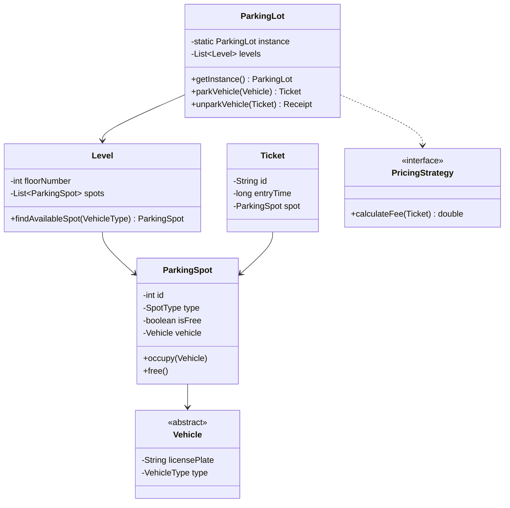
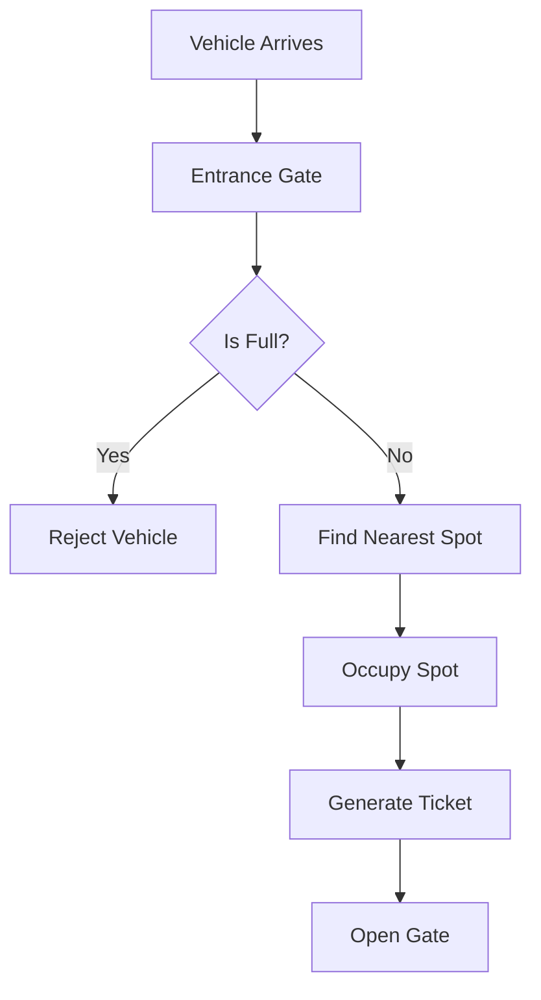

# Design Parking Lot

> **Difficulty**: Medium
> **Topics**: Object-Oriented Design, Singleton, Factory Pattern, Strategy Pattern
> **Key Concepts**: Managing shared resources, pricing logic, concurrency.

## Problem Statement

Design a Parking Lot system with the following requirements:
1.  **Multiple Levels**: The parking lot has multiple levels.
2.  **Spot Types**: Supports different vehicle types (Motorcycle, Car, Truck) with specific spots.
3.  **Entry/Exit**: Issues a ticket on entry and calculates fees on exit.
4.  **Capacity**: Tracks available spots in real-time.
5.  **Pricing**: Flexible pricing strategy (e.g., $2 for first hour, then $1/hr).

## Class Diagram



## Flow Chart: Park Vehicle



## Java Implementation

```java
import java.util.*;
import java.util.concurrent.*;
import java.time.Instant;

// 1. Enums
enum VehicleType { MOTORCYCLE, CAR, TRUCK }
enum SpotType { MOTORCYCLE, COMPACT, LARGE }

// 2. Vehicle Hierarchy
abstract class Vehicle {
    private String licensePlate;
    private VehicleType type;

    public Vehicle(String licensePlate, VehicleType type) {
        this.licensePlate = licensePlate;
        this.type = type;
    }

    public VehicleType getType() { return type; }
}

class Car extends Vehicle {
    public Car(String licensePlate) { super(licensePlate, VehicleType.CAR); }
}

class Motorcycle extends Vehicle {
    public Motorcycle(String licensePlate) { super(licensePlate, VehicleType.MOTORCYCLE); }
}

class Truck extends Vehicle {
    public Truck(String licensePlate) { super(licensePlate, VehicleType.TRUCK); }
}

// 3. Parking Spot
class ParkingSpot {
    private int id;
    private SpotType type;
    private boolean isFree;
    private Vehicle vehicle;

    public ParkingSpot(int id, SpotType type) {
        this.id = id;
        this.type = type;
        this.isFree = true;
    }

    public boolean isFree() { return isFree; }
    public SpotType getType() { return type; }

    public synchronized void occupy(Vehicle v) {
        this.vehicle = v;
        this.isFree = false;
    }

    public synchronized void free() {
        this.vehicle = null;
        this.isFree = true;
    }
}

// 4. Ticket
class Ticket {
    String id;
    long entryTime;
    ParkingSpot spot;

    public Ticket(ParkingSpot spot) {
        this.id = UUID.randomUUID().toString();
        this.entryTime = System.currentTimeMillis();
        this.spot = spot;
    }
}

// 5. Level
class Level {
    private int floor;
    private List<ParkingSpot> spots;

    public Level(int floor, int numSpots) {
        this.floor = floor;
        this.spots = new ArrayList<>(numSpots);
        // Simplified: Split spots equally for demo
        for (int i = 0; i < numSpots; i++) {
            SpotType type = (i < numSpots/3) ? SpotType.MOTORCYCLE : 
                            (i < 2*numSpots/3) ? SpotType.COMPACT : SpotType.LARGE;
            spots.add(new ParkingSpot(i, type));
        }
    }

    public ParkingSpot findAvailableSpot(VehicleType vType) {
        SpotType needed = getSpotTypeForVehicle(vType);
        for (ParkingSpot s : spots) {
            if (s.isFree() && s.getType() == needed) {
                return s;
            }
        }
        return null;
    }

    private SpotType getSpotTypeForVehicle(VehicleType vType) {
        switch (vType) {
            case MOTORCYCLE: return SpotType.MOTORCYCLE;
            case CAR: return SpotType.COMPACT;
            default: return SpotType.LARGE;
        }
    }
}

// 6. ParkingLot (Singleton)
class ParkingLot {
    private static ParkingLot instance;
    private List<Level> levels;
    
    private ParkingLot() {
        levels = new ArrayList<>();
    }

    public static synchronized ParkingLot getInstance() {
        if (instance == null) instance = new ParkingLot();
        return instance;
    }

    public void addLevel(Level level) {
        levels.add(level);
    }

    public Ticket parkVehicle(Vehicle v) {
        for (Level l : levels) {
            ParkingSpot spot = l.findAvailableSpot(v.getType());
            if (spot != null) {
                spot.occupy(v);
                return new Ticket(spot);
            }
        }
        throw new RuntimeException("Gridlock! No spot available.");
    }

    public double unparkVehicle(Ticket ticket) {
        ticket.spot.free();
        long duration = System.currentTimeMillis() - ticket.entryTime;
        // Simple pricing: $1 per second (for demo speed)
        return (duration / 1000.0) * 1.0;
    }
}

// 7. Client
public class ParkingSystem {
    public static void main(String[] args) throws InterruptedException {
        ParkingLot lot = ParkingLot.getInstance();
        lot.addLevel(new Level(1, 10)); // 10 spots

        Vehicle car = new Car("ABC-123");
        System.out.println("Parking car...");
        Ticket ticket = lot.parkVehicle(car);
        System.out.println("Ticket issued: " + ticket.id);

        Thread.sleep(2000); // Wait 2 sec

        double fee = lot.unparkVehicle(ticket);
        System.out.println("Unparked. Fee: $" + fee);
    }
}
```

## Interview Q&A

**Q: "How to handle concurrency?"**
- A: "Use `synchronized` on `occupy()`/`free()` methods in `ParkingSpot`. For high throughput, use `ConcurrentHashMap` or a distributed lock (Redis) if running multiple instances."

**Q: "How to find the nearest spot?"**
- A: "Use a Min-Heap or Sorted Set (TreeSet) to store available spots, ordered by distance from entrance. Allocator picks `heap.poll()`."

**Q: "Pricing flexibility?"**
- A: "Use Strategy Pattern. `PricingStrategy` interface with implementations like `HourlyStrategy`, `FlatRateStrategy`. Inject strategy into ParkingLot."
