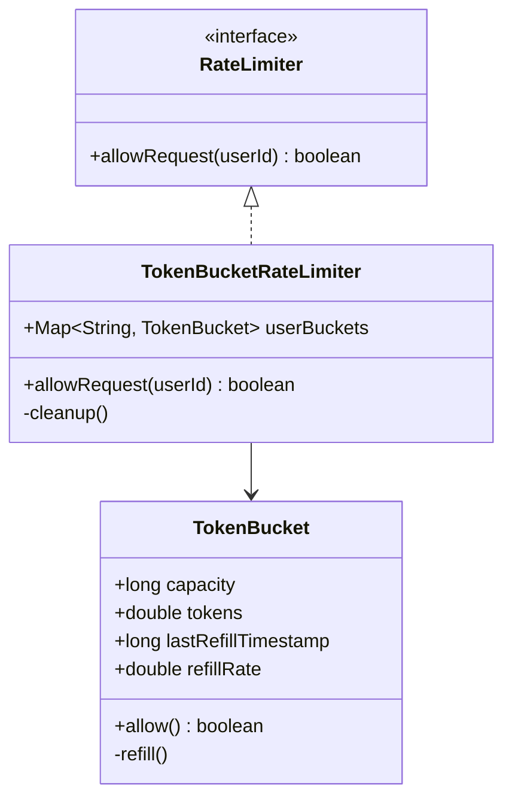

# Design Rate Limiter (Low Level)

> **Difficulty**: Medium  
> **Topics**: Concurrency, Design Patterns (Strategy), Token Bucket Algorithm  
> **Context**: Designing the internal class implementation (Thread-Safe), not the distributed system.

## Problem Statement

Implement a thread-safe Rate Limiter library.
- **Rules**: Limit requests per UserID (e.g., 10 req/sec).
- **Behavior**: Return `True` (Allow) or `False` (Drop).
- **Constraint**: Must handle multi-threaded environment.

## Algorithm: Token Bucket

We use **Token Bucket** (Lazy Refill).
- **Why?**: Memory efficient (store just timestamps), handles bursts better than sliding log.
- **Lazy Refill**: Don't use a background timer. On each request, calculate `tokens_to_add = (now - last_refill) * rate`.

## Implementation

## Java Implementation (Thread-Safe Token Bucket)

#### Class Diagram



#### Flow Chart: Allow Request

```mermaid
flowchart TD
    A[Request(UserID)] --> B{Bucket Exists?}
    B -- No --> C[Create New Bucket]
    B -- Yes --> D[Get Bucket]
    C --> D
    D --> E[Lock Bucket]
    E --> F[Refill Tokens based on Time Elapsed]
    F --> G{Tokens >= 1?}
    G -- Yes --> H[Decrement Token]
    H --> I[Unlock & Return TRUE]
    G -- No --> J[Unlock & Return FALSE]
```

#### Code

```java
import java.util.*;
import java.util.concurrent.*;

// 1. Core Bucket Entity
class TokenBucket {
    private final long capacity;
    private final double refillRate; // Tokens per second
    private double tokens;
    private long lastRefillTimestamp;

    public TokenBucket(long capacity, double refillRate) {
        this.capacity = capacity;
        this.refillRate = refillRate;
        this.tokens = capacity;
        this.lastRefillTimestamp = System.nanoTime();
    }

    public synchronized boolean allow() {
        refill();
        if (tokens >= 1) {
            tokens -= 1;
            return true;
        }
        return false;
    }

    private void refill() {
        long now = System.nanoTime();
        double elapsedSeconds = (now - lastRefillTimestamp) / 1_000_000_000.0;
        double tokensToAdd = elapsedSeconds * refillRate;
        
        if (tokensToAdd > 0) {
            tokens = Math.min(capacity, tokens + tokensToAdd);
            lastRefillTimestamp = now;
        }
    }
}

// 2. Strategy Interface
interface RateLimiter {
    boolean allowRequest(String userId);
}

// 3. Concrete Strategy
class TokenBucketRateLimiter implements RateLimiter {
    private final Map<String, TokenBucket> userBuckets = new ConcurrentHashMap<>();
    private final long capacity;
    private final double refillRate;

    public TokenBucketRateLimiter(long capacity, double refillRate) {
        this.capacity = capacity;
        this.refillRate = refillRate;
    }

    @Override
    public boolean allowRequest(String userId) {
        // ComputeIfAbsent is atomic for map insertion, but subsequent allow() needs to be thread-safe for the specific bucket
        TokenBucket bucket = userBuckets.computeIfAbsent(userId, k -> new TokenBucket(capacity, refillRate));
        return bucket.allow();
    }
}

// 4. Client
public class RateLimiterService {
    public static void main(String[] args) throws InterruptedException {
        // 10 tokens max, refill 1 token/sec
        RateLimiter limiter = new TokenBucketRateLimiter(10, 1);

        String user = "User1";
        
        // Simulate bursts
        for (int i = 0; i < 12; i++) {
            boolean allowed = limiter.allowRequest(user);
            System.out.println("Request " + (i+1) + ": " + (allowed ? "Allowed" : "Denied"));
        }
        
        // Wait and retry
        Thread.sleep(2000); // Wait 2s -> Refill 2 tokens
        System.out.println("Request after wait: " + (limiter.allowRequest(user) ? "Allowed" : "Denied"));
    }
}
```

## Interview Q&A

**Q: "How to scale to distributed system?"**
- A: "This code works for single node. For distributed, replace local `TokenBucket` with Redis + Lua Script. Lua ensures atomicity of `get -> calculate -> set` operations."

**Q: "Memory Usage?"**
- A: "Cleanup old users. Use a background thread to remove keys in `user_buckets` that haven't been accessed for > 1 hour."
