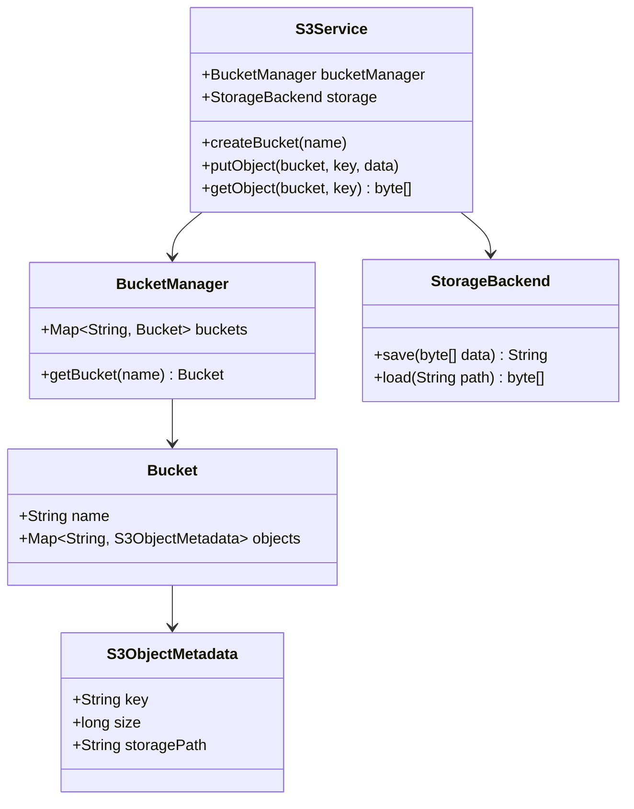

# Design AWS S3 (Object Storage)

> **Difficulty**: Hard  
> **Topics**: Distributed Systems, Blob Storage, Metadata Management, Consistent Hashing  
> **Features**: Put, Get, Delete, Buckets.

## Problem Statement

Design a simplified Object Storage Service.
- **Entities**: Buckets (Containers), Objects (Files).
- **Constraints**: Flat structure (Key-Value), Immutable objects (put overwrites).

## Architecture: Metadata vs Data

Decouple metadata from actual blob storage.

1.  **Metadata Store**: DB (DynamoDB/Cassandra) holding `{Key: "vacation.jpg", Size: 2MB, StoragePath: "/disk1/block_99"}`.
2.  **Blob Store**: Physical storage engine (HDD/SSD).

## Implementation

## Java Implementation

#### Class Diagram



#### Flow Chart: Put Object

```mermaid
flowchart TD
    A[Client: PutObject(Bucket, Key, Data)] --> B{Does Bucket Exist?}
    B -- No --> C[Error: Bucket Not Found]
    B -- Yes --> D[StorageBackend: Save Data to Disk/SSD]
    D --> E[Generate Storage Path / ID]
    E --> F[Create Metadata Object (Key, Size, Path)]
    F --> G[Bucket: Map Key -> Metadata]
    G --> H[Return Success]
```

#### Code

```java
import java.io.*;
import java.nio.file.*;
import java.util.*;
import java.util.concurrent.ConcurrentHashMap;

// 1. Storage Backend (The physical layer)
class StorageBackend {
    private String rootDir = "./s3_data";

    public StorageBackend() {
        new File(rootDir).mkdirs();
    }

    public String save(byte[] data) throws IOException {
        String pathId = UUID.randomUUID().toString();
        Path path = Paths.get(rootDir, pathId);
        Files.write(path, data);
        return path.toString();
    }

    public byte[] load(String pathId) throws IOException {
        return Files.readAllBytes(Paths.get(pathId));
    }
}

// 2. Metadata Entities
class S3ObjectMetadata {
    String key;
    long size;
    String storagePath;

    public S3ObjectMetadata(String key, long size, String storagePath) {
        this.key = key;
        this.size = size;
        this.storagePath = storagePath;
    }
}

class Bucket {
    String name;
    Map<String, S3ObjectMetadata> objects = new ConcurrentHashMap<>();

    public Bucket(String name) {
        this.name = name;
    }
}

// 3. S3 Service (Facade)
public class S3Service {
    private StorageBackend storage;
    private Map<String, Bucket> buckets = new ConcurrentHashMap<>();

    public S3Service() {
        this.storage = new StorageBackend();
    }

    public void createBucket(String name) {
        buckets.putIfAbsent(name, new Bucket(name));
        System.out.println("Bucket created: " + name);
    }

    public void putObject(String bucketName, String key, byte[] data) throws IOException {
        Bucket bucket = buckets.get(bucketName);
        if (bucket == null) throw new IllegalArgumentException("Bucket not found");

        // 1. Save Blob
        String physicalPath = storage.save(data);

        // 2. Save Metadata
        S3ObjectMetadata meta = new S3ObjectMetadata(key, data.length, physicalPath);
        bucket.objects.put(key, meta);
        
        System.out.println("Object uploaded: " + key);
    }

    public byte[] getObject(String bucketName, String key) throws IOException {
        Bucket bucket = buckets.get(bucketName);
        if (bucket == null) throw new IllegalArgumentException("Bucket not found");

        S3ObjectMetadata meta = bucket.objects.get(key);
        if (meta == null) return null;

        return storage.load(meta.storagePath);
    }
    
    public static void main(String[] args) throws IOException {
        S3Service s3 = new S3Service();
        s3.createBucket("my-images");
        s3.putObject("my-images", "vacation.png", new byte[]{10, 20, 30});
        
        byte[] data = s3.getObject("my-images", "vacation.png");
        System.out.println("Downloaded bytes: " + data.length);
    }
}
```

## Key Design Challenges

1.  **Large Files (Multipart Upload)**:
    *   Break file into chunks. `initiate()`, `upload_part()`, `complete()`.
    *   Metadata stores list of chunk IDs.
2.  **Folder Illusion**:
    *   S3 is flat. "folders" are just prefixes in the key string.
    *   Renaming a "folder" is $O(N)$ (copy + delete).
3.  **Versioning**:
    *   Change Metadata Store to map `Key -> List[Object]`.
