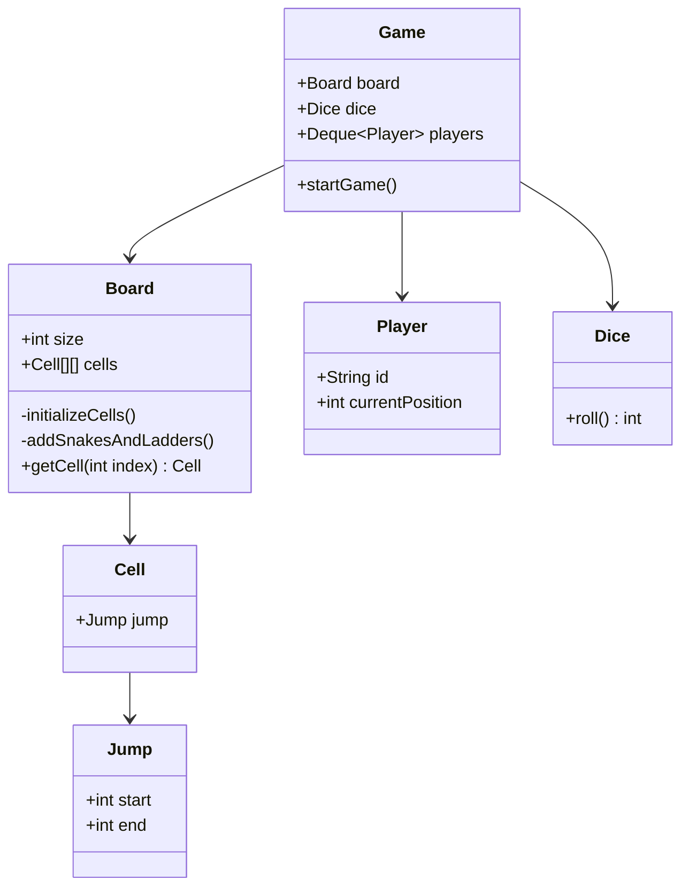
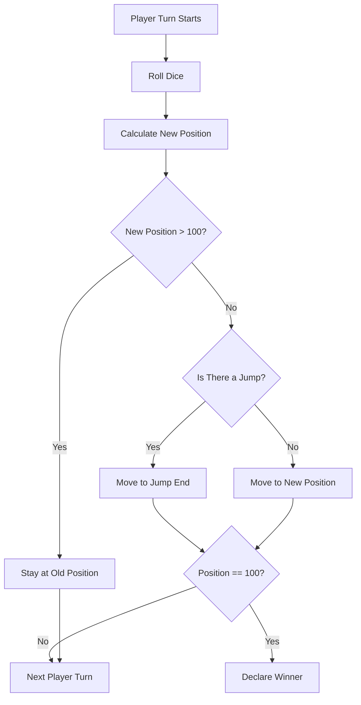

# Design Snake & Ladder

> **Difficulty**: Beginner  
> **Topics**: Board Games, HashMap / 1D Array Logic, Randomness  
> **Entities**: Board, Dice, Player, Jump (Snake/Ladder).

## Problem Statement

Create a 10x10 board game where players race to 100.
- **Snakes**: Move you down.
- **Ladders**: Move you up.

## Core Logic

- **Board**: Don't use 2D array. Use 1D array of size 101.
- **Jump**: Snake and Ladder are the SAME entity `Jump(start, end)`.
  - Snake: start > end.
  - Ladder: start < end.

## Implementation

## Implementation (Java)

#### Class Diagram



#### Flow Chart: Game Turn



#### Code

```java
import java.util.*;
import java.util.concurrent.ThreadLocalRandom;

// 1. Jump Entity (Snake or Ladder)
class Jump {
    int start;
    int end;

    public Jump(int start, int end) {
        this.start = start;
        this.end = end;
    }
}

// 2. Cell Entity
class Cell {
    Jump jump;
}

// 3. Board Entity
class Board {
    Cell[][] cells;

    Board(int boardSize, int numberOfSnakes, int numberOfLadders) {
        initializeCells(boardSize);
        addSnakesLadders(cells, numberOfSnakes, numberOfLadders);
    }

    private void initializeCells(int boardSize) {
        cells = new Cell[boardSize][boardSize];
        for(int i=0;i<boardSize;i++) {
            for(int j=0; j<boardSize;j++) {
                Cell cellObj = new Cell();
                cells[i][j] = cellObj;
            }
        }
    }

    private void addSnakesLadders(Cell[][] cells, int numberOfSnakes, int numberOfLadders) {
        // Logic to add random jumps (omitted for brevity)
        // Ensure start > end for Snake, start < end for Ladder
    }
    
    public Cell getCell(int playerPosition) {
        int boardRow = playerPosition / cells.length;
        int boardCol = (playerPosition % cells.length);
        return cells[boardRow][boardCol];
    }
}

// 4. Player Entity
class Player {
    String id;
    int currentPosition;

    public Player(String id, int currentPosition) {
        this.id = id;
        this.currentPosition = currentPosition;
    }
}

// 5. Dice Entity
class Dice {
    int diceCount;
    int min = 1;
    int max = 6;

    public Dice(int diceCount) {
        this.diceCount = diceCount;
    }

    public int rollDice() {
        int totalSum = 0;
        int diceUsed = 0;
        while (diceUsed < diceCount) {
            totalSum += ThreadLocalRandom.current().nextInt(min, max + 1);
            diceUsed++;
        }
        return totalSum;
    }
}

// 6. Game Orchestrator
public class Game {
    Board board;
    Dice dice;
    Deque<Player> playersList = new LinkedList<>();
    Player winner;

    public Game() {
        initializeGame();
    }

    private void initializeGame() {
        board = new Board(10, 5, 5);
        dice = new Dice(1);
        winner = null;
        addPlayers();
    }

    private void addPlayers() {
        Player player1 = new Player("p1", 0);
        Player player2 = new Player("p2", 0);
        playersList.add(player1);
        playersList.add(player2);
    }

    public void startGame() {
        while(winner == null) {
            // Check whose turn now
            Player playerTurn = playersList.removeFirst();
            System.out.println("player turn is:" + playerTurn.id + " current position is: " + playerTurn.currentPosition);

            // Roll the dice
            int diceValue = dice.rollDice();

            // Calculate new position
            int playerNewPosition = playerTurn.currentPosition + diceValue;
            playerNewPosition = jumpCheck(playerNewPosition);
            playerTurn.currentPosition = playerNewPosition;

            System.out.println("player turn is:" + playerTurn.id + " new Position is: " + playerNewPosition);

            if(playerNewPosition >= 100){
                winner = playerTurn;
            }

            playersList.addLast(playerTurn);
        }

        System.out.println("WINNER IS:" + winner.id);
    }

    private int jumpCheck(int playerNewPosition) {
        if(playerNewPosition > 100 ){
            return playerNewPosition;
        }

        Cell cell = board.getCell(playerNewPosition);
        if(cell.jump != null && cell.jump.start == playerNewPosition) {
            String jumpBy = (cell.jump.start < cell.jump.end) ? "ladder" : "snake";
            System.out.println("jump done by: " + jumpBy);
            return cell.jump.end;
        }
        return playerNewPosition;
    }
}
```

## Key Points

1.  **Polymorphism (Not needed)**:
    -   We don't need `class Snake` and `class Ladder`. They have identical behavior (teleport player). A single `Jump` class is cleaner.
2.  **Dice Strategy**:
    -   If interviewer asks for "Rigged Dice", implement `DiceStrategy` interface.
