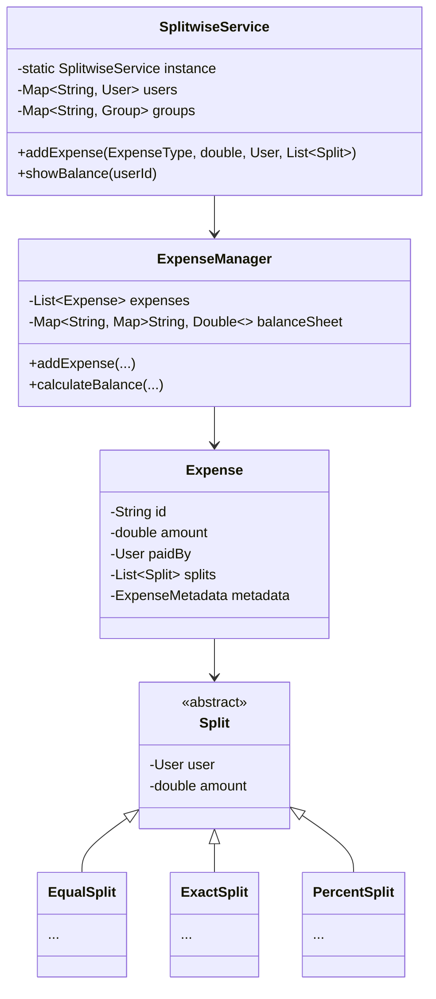
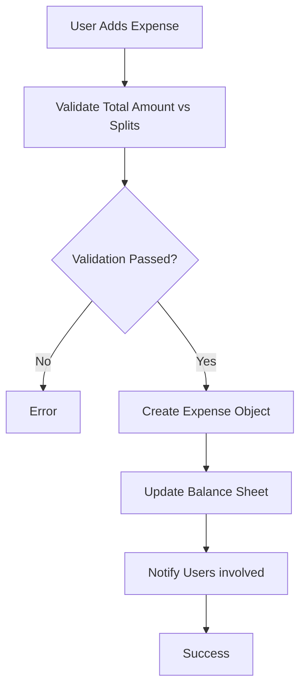

# Design Splitwise

> **Difficulty**: Medium
> **Topics**: Strategy Pattern, Graph Simplification, Observer Pattern
> **Key Concepts**: Managing debts, different split types (Equal, Exact, Percent).

## Problem Statement

Design an expense sharing application like Splitwise that:
1.  **Users & Groups**: Users can be part of groups.
2.  **Add Expense**: Users can add expenses paid by one, split among many.
3.  **Split Support**: Supports Equal, Exact, and Percentage splits.
4.  **Balance Sheet**: Shows who owes whom.
5.  **Simplify Debt**: (Optional optimization) Minimize transactions.

## Class Diagram



## Flow Chart: Add Expense



## Java Implementation

```java
import java.util.*;

// 1. Core Entities
class User {
    String id;
    String name;
    public User(String id, String name) { this.id = id; this.name = name; }
}

abstract class Split {
    User user;
    double amount;
    public Split(User user) { this.user = user; }
    public double getAmount() { return amount; }
    public void setAmount(double amount) { this.amount = amount; }
}

class EqualSplit extends Split {
    public EqualSplit(User user) { super(user); }
}

class ExactSplit extends Split {
    public ExactSplit(User user, double amount) { super(user); this.amount = amount; }
}

// 2. Expense Models
class Expense {
    String id;
    double amount;
    User paidBy;
    List<Split> splits;
    
    public Expense(double amount, User paidBy, List<Split> splits) {
        this.amount = amount;
        this.paidBy = paidBy;
        this.splits = splits;
    }
}

// 3. Managers
class ExpenseManager {
    List<Expense> expenses;
    Map<String, Map<String, Double>> balanceSheet; // UserID -> (OwedUserID -> Amount)

    public ExpenseManager() {
        expenses = new ArrayList<>();
        balanceSheet = new HashMap<>();
    }

    public void addExpense(double amount, User paidBy, List<Split> splits) {
        Expense expense = new Expense(amount, paidBy, splits);
        expenses.add(expense);

        for (Split split : splits) {
            String paidTo = split.user.id;
            Map<String, Double> balances = balanceSheet.computeIfAbsent(paidBy.id, k -> new HashMap<>());
            
            // Current User (paidBy) receives (+amount) from split user
            if (!balances.containsKey(paidTo)) balances.put(paidTo, 0.0);
            balances.put(paidTo, balances.get(paidTo) + split.getAmount());

            // Split User (paidTo) owes (-amount) to paidBy
            balances = balanceSheet.computeIfAbsent(paidTo, k -> new HashMap<>());
            if (!balances.containsKey(paidBy.id)) balances.put(paidBy.id, 0.0);
            balances.put(paidBy.id, balances.get(paidBy.id) - split.getAmount());
        }
    }

    public void showBalance(String userId) {
        System.out.println("Balance for " + userId + ":");
        Map<String, Double> balances = balanceSheet.get(userId);
        if (balances == null) {
            System.out.println("No balances.");
            return;
        }
        
        for (Map.Entry<String, Double> entry : balances.entrySet()) {
            if (entry.getValue() != 0) {
                printBalance(userId, entry.getKey(), entry.getValue());
            }
        }
    }

    private void printBalance(String user1, String user2, double amount) {
        if (amount < 0) {
            System.out.println(user1 + " owes " + user2 + ": " + Math.abs(amount));
        } else if (amount > 0) {
            System.out.println(user2 + " owes " + user1 + ": " + amount);
        }
    }
}

// 4. Client
public class SplitwiseDemo {
    public static void main(String[] args) {
        User u1 = new User("u1", "Alice");
        User u2 = new User("u2", "Bob");
        User u3 = new User("u3", "Charlie");

        ExpenseManager manager = new ExpenseManager();

        // 1. Equal Split: Alice paid 100 for Bob and Charlie
        // (Implementation note: Usually Service handles 'Equal' logic to set amounts)
        // Here we simulate amounts are pre-calculated for simplicity or use specific Split logic
        
        // Simulating Alice paying 300, split equally (100 each)
        List<Split> splits = new ArrayList<>();
        Split s1 = new EqualSplit(u1); s1.setAmount(100);
        Split s2 = new EqualSplit(u2); s2.setAmount(100);
        Split s3 = new EqualSplit(u3); s3.setAmount(100);
        splits.add(s1); splits.add(s2); splits.add(s3);

        manager.addExpense(300, u1, splits);
        
        manager.showBalance("u2"); // Bob owes Alice 100
        manager.showBalance("u1"); // Bob owes Alice 100, Charlie owes Alice 100
    }
}
```

## Interview Q&A

**Q: "How to simplify debts (Debt Graph optimization)?"**
- A: "Use a Min-Heap and Max-Heap. Calculate net balance for each user. Push creditors to Max-Heap, debtors to Min-Heap. Pop max creditor and max debtor, settle minimum of absolute values, re-push remainder. Repeat until heaps empty."

**Q: "How to handle huge number of users?"**
- A: "Sharding users by ID. For groups, shard by GroupID so group expenses are on the same node."

**Q: "How to validate percentage splits?"**
- A: "Sum of all percentages must equal 100%. Check this in the `ExpenseValidator` before processing."
