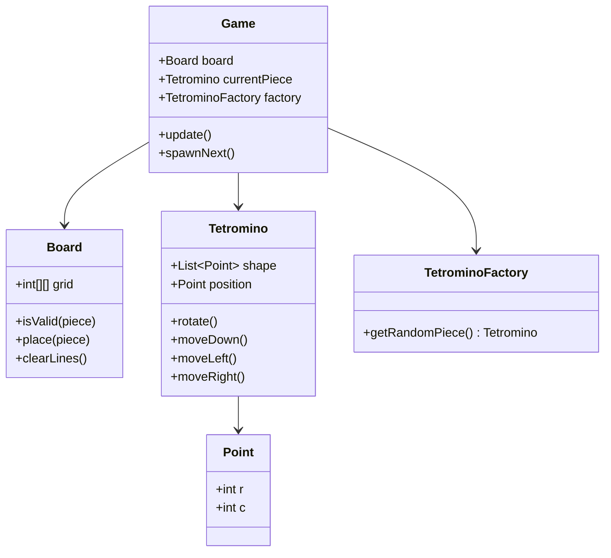

# Design Tetris Game

> **Difficulty**: Medium  
> **Topics**: Matrix Manipulation, Game Loop, Factory Pattern  
> **Key Logic**: Rotation Matrix, Collision Detection.

## Problem Statement

Blocks fall. Move them to clear lines.
- **Tetrominoes**: Shapes (I, O, T, S, Z, J, L).
- **Rotation**: 90-degree turn.

## Core Concepts

1.  **Shapes**: Defined as list of `Point(row, col)` relative to a pivot `(0,0)`.
2.  **Rotation Formula**: To rotate $(x, y)$ 90-deg clockwise: $(y, -x)$.
3.  **Collision**: Handled by Board. "Does this Point overlap with existing Block?"

## Implementation (Snippet)

## Java Implementation

#### Class Diagram



#### Flow Chart: Game Loop

```mermaid
flowchart TD
    A[Game Start] --> B[Spawn Random Piece]
    B --> C[Loop: Update / Tick]
    C --> D[Gravity: Move Piece Down]
    D --> E{Collision?}
    E -- No --> F[Update Display]
    E -- Yes --> G[Undo Move (Move Up)]
    G --> H[Lock Piece on Board]
    H --> I[Check & Clear Full Lines]
    I --> J{Is Game Over? (Spawn Blocked)}
    J -- Yes --> K[End Game]
    J -- No --> B
```

#### Code

```java
import java.util.*;

// 1. Point
class Point {
    int r, c;
    public Point(int r, int c) { this.r = r; this.c = c; }
}

// 2. Tetromino (Shape)
class Tetromino {
    List<Point> shape; // Relative coordinates
    Point pos; // Absolute position on board

    public Tetromino(List<Point> shape) {
        this.shape = new ArrayList<>();
        for(Point p : shape) this.shape.add(new Point(p.r, p.c));
        this.pos = new Point(0, 4); // Start at top-middle
    }

    // Rotate 90 degrees clockwise: (r, c) -> (c, -r)
    public void rotate() {
        for (Point p : shape) {
            int temp = p.r;
            p.r = p.c;
            p.c = -temp;
        }
    }

    public List<Point> getAbsolutePositions() {
        List<Point> abs = new ArrayList<>();
        for (Point p : shape) {
            abs.add(new Point(this.pos.r + p.r, this.pos.c + p.c));
        }
        return abs;
    }
    
    public void moveDown() { pos.r++; }
    public void moveUp() { pos.r--; }
    public void moveLeft() { pos.c--; }
    public void moveRight() { pos.c++; }
}

// 3. Factory Pattern
class TetrominoFactory {
    public static Tetromino getRandomPiece() {
        // Example: T-Shape
        //  *
        // ***
        List<Point> tShape = Arrays.asList(
            new Point(0, 0), // Center
            new Point(0, -1),
            new Point(0, 1),
            new Point(-1, 0)
        );
        return new Tetromino(tShape);
    }
}

// 4. Board
class Board {
    int rows = 20;
    int cols = 10;
    int[][] grid = new int[rows][cols];

    public boolean isValid(Tetromino piece) {
        for (Point p : piece.getAbsolutePositions()) {
            // Check Bounds
            if (p.r < 0 || p.r >= rows || p.c < 0 || p.c >= cols) return false;
            // Check Collision with existing blocks
            if (grid[p.r][p.c] != 0) return false;
        }
        return true;
    }

    public void place(Tetromino piece) {
        for (Point p : piece.getAbsolutePositions()) {
            grid[p.r][p.c] = 1; // Mark as occupied
        }
    }

    public void clearLines() {
        // Logic to remove full rows and shift down
        System.out.println("Checking for full lines...");
    }
}

// 5. Game Loop
class Game {
    Board board = new Board();
    Tetromino piece;
    boolean gameOver = false;

    public void start() {
        spawnNext();
        while (!gameOver) {
            update();
            try { Thread.sleep(500); } catch (Exception e) {}
        }
        System.out.println("Game Over");
    }

    private void spawnNext() {
        piece = TetrominoFactory.getRandomPiece();
        if (!board.isValid(piece)) {
            gameOver = true;
        }
    }

    private void update() {
        // Gravity
        piece.moveDown();
        if (!board.isValid(piece)) {
            piece.moveUp(); // Undo
            board.place(piece);
            board.clearLines();
            spawnNext();
        } else {
            System.out.println("Piece moved down");
        }
    }
}
```

## Interview Q&A

**Q: "How to decouple Shapes from Game?"**
- A: "Tetromino Factory. `Factory.get_random_piece()` returns a Shape subclass. Game doesn't know about specific shapes."
