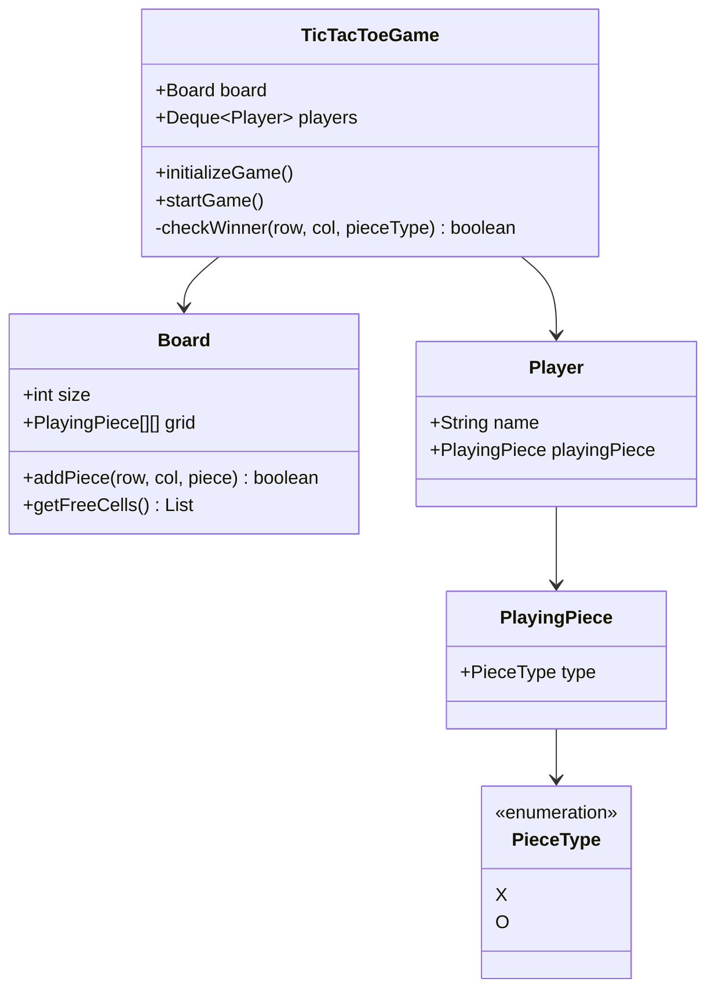
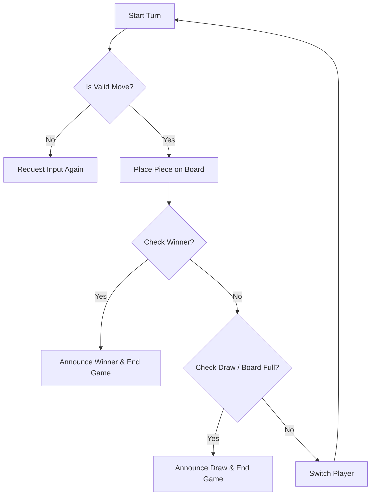

# Design Tic-Tac-Toe

> **Difficulty**: Beginner  
> **Topics**: Object-Oriented Design, Board Game Logic, 2D Arrays  
> **Extension**: NxN Board, AI Player (Minimax).

## Problem Statement

Design a simple 2-player Tic-Tac-Toe game.
- **Board**: 3x3 Grid.
- **Pieces**: X and O.
- **Rules**: Take turns. First to get row, col, or diagonal wins.

## Class Design

### 1. Piece (Enum & Class)

```java
public enum PieceType {
    X, O;
}

public class PlayingPiece {
    public PieceType type;

    public PlayingPiece(PieceType type) {
        this.type = type;
    }
}

public class PlayingPieceX extends PlayingPiece {
    public PlayingPieceX() {
        super(PieceType.X);
    }
}

public class PlayingPieceO extends PlayingPiece {
    public PlayingPieceO() {
        super(PieceType.O);
    }
}
```

### 2. Board

```java
import java.util.*;

public class Board {
    public int size;
    public PlayingPiece[][] grid;

    public Board(int size) {
        this.size = size;
        this.grid = new PlayingPiece[size][size];
    }

    public boolean addPiece(int row, int col, PlayingPiece piece) {
        if (grid[row][col] != null) {
            return false;
        }
        grid[row][col] = piece;
        return true;
    }

    public void printBoard() {
        for (int i = 0; i < size; i++) {
            for (int j = 0; j < size; j++) {
                if (grid[i][j] != null) {
                    System.out.print(grid[i][j].type + "   ");
                } else {
                    System.out.print("    ");
                }
                System.out.print(" | ");
            }
            System.out.println();
        }
    }
    
    public List<int[]> getFreeCells() {
        List<int[]> freeCells = new ArrayList<>();
        for (int i = 0; i < size; i++) {
            for (int j = 0; j < size; j++) {
                if (grid[i][j] == null) {
                    freeCells.add(new int[]{i, j});
                }
            }
        }
        return freeCells;
    }
}
```

### 3. Game Orchestrator (Controller)

#### Class Diagram



#### Flow Chart: Make a Move



#### Java Implementation

```java
import java.util.*;

public class TicTacToeGame {
    Deque<Player> players;
    Board board;

    public void initializeGame() {
        players = new LinkedList<>();
        PlayingPieceX pieceX = new PlayingPieceX();
        Player player1 = new Player("Player1", pieceX);

        PlayingPieceO pieceO = new PlayingPieceO();
        Player player2 = new Player("Player2", pieceO);

        players.add(player1);
        players.add(player2);

        board = new Board(3);
    }

    public String startGame() {
        boolean noWinner = true;
        while (noWinner) {
            
            // Take the player whose turn is next
            Player playerTurn = players.removeFirst();
            
            // Get free space from the board
            board.printBoard();
            List<int[]> freeSpaces = board.getFreeCells();
            if (freeSpaces.isEmpty()) {
                noWinner = false;
                continue;
            }

            // Read the user input
            System.out.print("Player: " + playerTurn.name + " Enter row,column: ");
            Scanner inputScanner = new Scanner(System.in);
            String s = inputScanner.nextLine();
            String[] values = s.split(",");
            int inputRow = Integer.valueOf(values[0]);
            int inputCol = Integer.valueOf(values[1]);

            // Place the piece
            boolean pieceAddedSuccessfully = board.addPiece(inputRow, inputCol, playerTurn.playingPiece);
            if (!pieceAddedSuccessfully) {
                // Player can not insert the piece into this cell, player has to choose another cell
                System.out.println("Incorrect position chosen, try again");
                players.addFirst(playerTurn);
                continue;
            }
            players.addLast(playerTurn);

            boolean winner = isThereWinner(inputRow, inputCol, playerTurn.playingPiece.type);
            if (winner) {
                return playerTurn.name;
            }
        }
        return "tie";
    }

    public boolean isThereWinner(int row, int col, PieceType pieceType) {
        boolean rowMatch = true;
        boolean colMatch = true;
        boolean diagonalMatch = true;
        boolean antiDiagonalMatch = true;

        // Need to check in row
        for (int i = 0; i < board.size; i++) {
            if (board.grid[row][i] == null || board.grid[row][i].type != pieceType) {
                rowMatch = false;
            }
        }

        // Need to check in column
        for (int i = 0; i < board.size; i++) {
            if (board.grid[i][col] == null || board.grid[i][col].type != pieceType) {
                colMatch = false;
            }
        }

        // Need to check diagonals
        for (int i = 0, j = 0; i < board.size; i++, j++) {
            if (board.grid[i][j] == null || board.grid[i][j].type != pieceType) {
                diagonalMatch = false;
            }
        }

        // Need to check anti-diagonals
        for (int i = 0, j = board.size - 1; i < board.size; i++, j--) {
            if (board.grid[i][j] == null || board.grid[i][j].type != pieceType) {
                antiDiagonalMatch = false;
            }
        }

        return rowMatch || colMatch || diagonalMatch || antiDiagonalMatch;
    }
}
```

```java
// Simple Player Class
public class Player {
    public String name;
    public PlayingPiece playingPiece;

    public Player(String name, PlayingPiece playingPiece) {
        this.name = name;
        this.playingPiece = playingPiece;
    }
}
```

## Interview Q&A

**Q: "How to scale to NxN board?"**
- A: "Logic remains same. The `check_winner` function iterates `range(N)` instead of hardcoded 3."

**Q: "How to add Undo feature?"**
- A: "Use Command Pattern or store moves in a Stack `[(row, col, player)]`. `Undo` pops stack and sets `grid[row][col] = None`."
