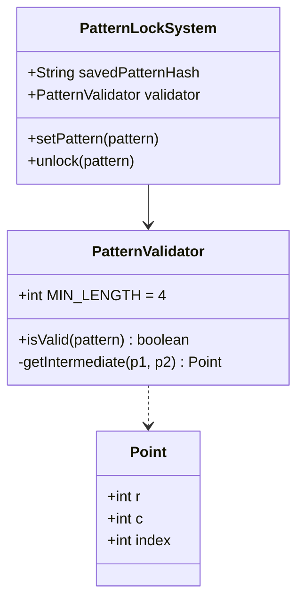

# Design Android Unlock Pattern

> **Difficulty**: Medium  
> **Topics**: Graph Theory, DFS/Backtracking, Validation Logic  
> **Key Concept**: Midpoint Formula for Skip Logic

## Problem Statement

Design the Android 3x3 Grid Unlock Pattern system.
- **Grid**: 9 dots (0-8).
- **Rules**:
  1.  Min length 4 nodes.
  2.  Cannot visit same node twice (unless hopping over it, but that node must be visited).
  3.  **Skip Rule**: Connecting a non-adjacent node (e.g., 0 to 2) is ONLY valid if the middle node (1) has completely been visited.

## Implementation

## Java Implementation

#### Class Diagram



#### Flow Chart: Validation Logic

```mermaid
flowchart TD
    A[Start Validation] --> B{Length >= 4?}
    B -- No --> C[Invalid]
    B -- Yes --> D[Init: Visited Set]
    D --> E[Iterate Points (For P[i] -> P[i+1])]
    E --> F{Is Next Visited?}
    F -- Yes --> C
    F -- No --> G[Calculate Midpoint]
    G --> H{Is There Midpoint?}
    H -- No --> I[Valid Move]
    H -- Yes --> J{Is Midpoint Visited?}
    J -- No --> C[Invalid (Skip Rule)]
    J -- Yes --> I
    I --> K[Add Next to Visited]
    K --> L{More Points?}
    L -- Yes --> E
    L -- No --> M[Valid Pattern]
```

#### Code

```java
import java.util.*;

// 1. Point Entity
class Point {
    int r, c;
    int index;

    public Point(int r, int c) {
        this.r = r;
        this.c = c;
        this.index = r * 3 + c;
    }

    @Override
    public boolean equals(Object o) {
        if (this == o) return true;
        if (o == null || getClass() != o.getClass()) return false;
        Point point = (Point) o;
        return r == point.r && c == point.c;
    }

    @Override
    public int hashCode() {
        return Objects.hash(r, c);
    }
}

// 2. Validator (The Brains)
class PatternValidator {
    private static final int MIN_LENGTH = 4;

    public boolean isValid(List<Point> pattern) {
        if (pattern.size() < MIN_LENGTH) return false;

        Set<Point> visited = new HashSet<>();
        visited.add(pattern.get(0));

        for (int i = 0; i < pattern.size() - 1; i++) {
            Point curr = pattern.get(i);
            Point next = pattern.get(i + 1);

            // 1. Check Revisit
            if (visited.contains(next)) return false;

            // 2. Check Skip Logic
            Point intermediate = getIntermediate(curr, next);
            if (intermediate != null && !visited.contains(intermediate)) {
                // Illegal skip over unvisited node
                return false; 
            }

            visited.add(next);
        }
        return true;
    }

    // Returns the point EXACTLY between p1 and p2, or null if adjacency/knight-move
    private Point getIntermediate(Point p1, Point p2) {
        int rowSum = p1.r + p2.r;
        int colSum = p1.c + p2.c;

        // If sum is odd, midpoint is x.5 -> No integer node in between
        if (rowSum % 2 != 0 || colSum % 2 != 0) {
            return null;
        }

        int midR = rowSum / 2;
        int midC = colSum / 2;
        
        // Special case: Center of 3x3 is (1,1)
        // Ensure we handle "middle" correctly
        return new Point(midR, midC);
    }
}

// 3. System
public class PatternLockSystem {
    private String savedPatternHash;
    private PatternValidator validator;

    public PatternLockSystem() {
        this.validator = new PatternValidator();
    }

    public void setPattern(List<Point> pattern) {
        if (validator.isValid(pattern)) {
            this.savedPatternHash = hashPattern(pattern);
            System.out.println("Pattern Set Successfully!");
        } else {
            System.out.println("Invalid Pattern!");
        }
    }

    public boolean unlock(List<Point> inputPattern) {
        if (savedPatternHash == null) return false;
        return hashPattern(inputPattern).equals(savedPatternHash);
    }

    private String hashPattern(List<Point> pattern) {
        // Simple string representation for demo
        StringBuilder sb = new StringBuilder();
        for (Point p : pattern) sb.append(p.index).append("->");
        return sb.toString();
    }

    public static void main(String[] args) {
        PatternLockSystem system = new PatternLockSystem();
        
        // Valid L-Shape: 0 -> 3 -> 6 -> 7
        List<Point> pattern = Arrays.asList(
            new Point(0,0), new Point(1,0), new Point(2,0), new Point(2,1)
        );
        system.setPattern(pattern);
        
        // Invalid Skip: 0 -> 2 (Skipping 1 without visiting it)
        List<Point> invalid = Arrays.asList(
            new Point(0,0), new Point(0,2), new Point(1,1), new Point(2,2)
        );
        system.setPattern(invalid); 
    }
}
```

## Interview Q&A

**Q: "How to count total valid patterns?"**
- A: "Use DFS / Backtracking. Recursively traverse from each starting node, keeping track of `visited` set. Total is ~389,000 valid patterns."

**Q: "Security?"**
- A: "Salt and Hash the pattern sequence. Don't store plain lists."

**Q: "Knight's Move (0 -> 5)?"**
- A: "Valid. The midpoint logic `(0+1)/2 = 0.5` correctly returns `None`, meaning no node is skipped over."
